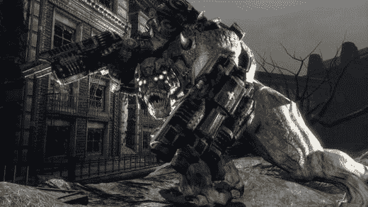

# 战争机器 PC 版回家过节| TechCrunch

> 原文：<https://web.archive.org/web/http://techcrunch.com/2007/07/11/gears-of-war-pc-edition-coming-home-for-the-holidays/>

之前报道的“最终”发布日期，PC 的战争机器已经被标记为“2007 年某个假日季节”和 50 美元的市场价。

以免你认为这将是一个简单的 Xbox 360 端口，Windows 版本将提供五个新的战役，三个新的多人地图，和一个额外的多人游戏场景。遗憾的是，多人游戏不能跨平台。

也许最令人耳目一新的是,《战争机器》将与 Windows Vista 和 Windows XP 兼容——在此提前感谢您将我们这些老玩家纳入您的小视频游戏俱乐部。Vista 版本将利用 DirectX 10 技术，所以它应该看起来非常漂亮，一旦我看到我的电脑在别人的新平台上运行，它可能会让我升级我的电脑。

哦，还有一件事:Brumak，Xbox 360 版本过场动画中那个巨大的怪物，将可以在 PC 版本中战斗。祝大家好运。

[宣布 PC 战争机器](https://web.archive.org/web/20160207041720/http://blogs.pcworld.com/gameon/archives/004865.html)【PC 世界】