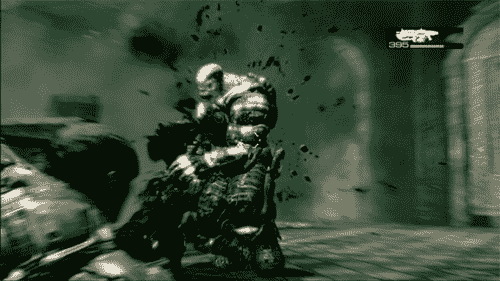

# 战争机器，虚幻竞技场 3 即将登陆 Mac

> 原文：<https://web.archive.org/web/http://techcrunch.com/2007/07/17/gears-of-war-unreal-tournament-3-coming-to-mac/>

几年前，如果有人说“你不能把 Mac 当游戏机用！”，我会回答“是的，我会给你一个。”唉，从那以后事情发生了巨大的变化。现在基于英特尔的 Mac 比以往任何时候都快，越来越多的游戏正在寻找到 OS X 的道路。Epic Games 副总裁 Mark Rein 现在透露，备受期待的*虚幻竞技场 3* 将与*战争机器*一起来到 Mac。

在接受 Rein 采访时，这位副总裁无意中透露了 Mac 版本的消息，随后很快证实这两款游戏确实都将登陆 Mac。这给游戏世界带来了一股新的变革之风，表明苹果确实可以让游戏在它的硬件上疯狂运行，更不用说它是一些不错的硬件了。这两款游戏的官方发布日期尚未确定，但可能会在假期发布。我们一定会让你更新。

[战争机器，虚幻竞技场 3 是 Mac 绑定的](https://web.archive.org/web/20131022180206/http://www.macworld.com/news/2007/07/16/gearsofwar/index.php?lsrc=mwrss)