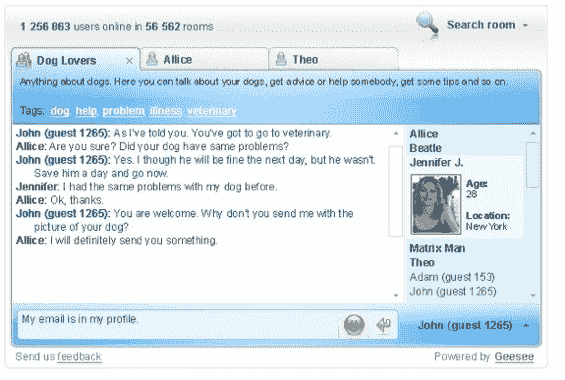

# Geesee 将提供跨站点标签聊天

> 原文：<https://web.archive.org/web/http://www.techcrunch.com:80/2006/09/04/geesee-to-offer-cross-site-chat-by-tag/>

  [Geesee](https://web.archive.org/web/20180208013109/http://www.geesee.com/) 是一家来自斯洛伐克的早期创业公司，将结合热门网络聊天、标签搜索和小工具。如果你已经看过 [MeeboMe](https://web.archive.org/web/20180208013109/http://www.techcrunch.com/2006/08/02/meebo-launches-meebome/) ，想象一下一个小部件，它将一个由标签组织的网络聊天室网络与许多博客和网页的接入点连接起来。

在他们的页面上放置一个 Geesee 窗口小部件的发布者将有助于与对该主题感兴趣但在网络上其他相关站点上的人进行关于他们页面主题的实时交流。对于商业供应商来说，这是一个巨大的控制损失，但对网站访问者来说却是实实在在的好处。我们已经知道，互联网上没有一个页面是某个给定主题的唯一页面——为什么不帮助我们与其他地方的其他相关页面上的人讨论该主题呢？Geesee 是一个有趣的例子，说明不断变化的电力动态在线测试。如果用户对数据和通信的控制是后线索列车的下一个关键问题之一，那么很可能会有更多这样的应用程序，以有趣的方式将不同的网页联系在一起。

Geesee 的名字来源于 Global Chat 的首字母缩写。它应该会在今年年底推出，但是你现在就可以加入测试账户的名单了。

下面是它的使用方法:如果我正在阅读一个关于照顾德国牧羊犬的博客，或者为一个孩子选择一所学校，或者决定是否从一本漫画书的背面购买海猴子——这个博客可以安装一个 Geesee 小工具，让我做许多事情。我可以用它来与访问同一网站的其他人聊天，同时，我可以用它来与其他网站上标记有与我相同术语的房间中的人聊天，或者我可以通过标签进行搜索，并通过任何其他参与页面与任何其他房间中的人聊天。

用户可以同时加入多个选项卡式聊天室，使用时无需注册，因此聊天可以是匿名的。私人频道也将可用。搜索结果将显示房间名称、标签、描述和每个房间的聊天人数。当然，特性集将会随着时间的推移而发展，但是已经有计划为主要的博客平台创建简单的插件。前端目前正在用 Flash 开发。聊天小部件既可以作为页面的嵌入部分，也可以作为链接的弹出窗口。这在异地航行时很重要。小部件将可调整大小。

从 Gabbly 到 Stickam 再到 MeeboMe，嵌入式聊天越来越普遍。我认为 Geesee 计划利用一个通过上下文相关的网站访问的标记聊天室网络是一个聪明而合理的下一步。为什么只谈论你所在的页面，而有更多相关话题的讨论呢？

网站所有者可能会对使用 Geesee 来促进他们的访问者与通过其他网站访问聊天网络的人之间的对话持谨慎态度，但用户希望能够在信任一个在线来源的信息之前与其他人进行协商。一个联合品牌的 Geesee 接入点可以为任何网站带来巨大的增加，但这样的未来将会陷入旧的俘获眼球模式。一些声誉系统和 OpenID 导入也将非常好。在安全方面也需要展示明确的步骤。

想象一下这样一种服务，它可以让你在决定从某个网站购买某件商品之前，与市场上的其他人实时联系。这显然符合用户的利益，也只符合供应商的利益，因为用户将来可能会期待类似这样的功能。这可能是供应商信心的一个很好的标志，可以鼓励和促进与对你所在网站的主题感兴趣的人的交流。你给我一个带有标签和选项卡的聊天框，这样我就可以在一个聊天选项卡中讨论各种已发表的关于德国牧羊犬的专家，在另一个选项卡中讨论购买动物护理书籍的最佳网站，我将非常感谢你的网站提供关于德国牧羊犬护理的书籍。

我认为 Geesee 与其他嵌入式聊天服务有很大的不同，我很有兴趣了解它的推出和采用情况。

