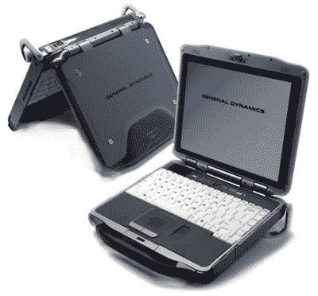

# 通用动力变得坚固耐用

> 原文：<https://web.archive.org/web/http://techcrunch.com/2006/09/08/general-dynamics-gets-rugged/>

然而，如果你真的打算攀登珠穆朗玛峰，你可能会想看看通用动力公司的 6 磅 8 盎司 [GoBook XR-1](https://web.archive.org/web/20150909122822/http://gd-computing.com/) 。它采用了英特尔酷睿双核处理器 1.83GHz 和各种内存和硬盘配置，旨在承受最折磨人的情况，通用动力公司是一家国防承包商，所以他们实际上设计了折磨人的情况。可能是一种逆向工程什么的。

该系统还包括夜光按键、许多无线选项(WLAN、WWAN、蓝牙和 GPS)、专用外部图形控制器，并可配备指纹和/或智能卡读卡器。在所有明显必要的升级之前，它将花费你 4300 美元。

[通用动力 GoBook XR-1 坚固笔记本](General%20Dynamics%20GoBook%20XR-1%20rugged%20notebook)【pop gadget via[Gizmodo](https://web.archive.org/web/20150909122822/http://gizmodo.com/gadgets/laptops/general-dynamics-gobook-xr1-rugged-notebook-199415.php)