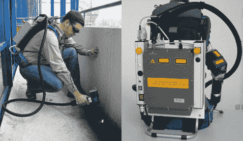

# 德国设计的背包式激光清洁器听起来真的很安全

> 原文：<https://web.archive.org/web/http://techcrunch.com/2007/08/09/german-engineered-backpack-mounted-laser-cleaner-sounds-really-safe/>

德国人发明了据称是世界上第一台背负式激光清洗器。显然需要这种大功率的清洁器。没有真正解释激光是如何清洁的，但我们可以假设它会烧掉一层层的污垢。可能不适合三岁以下的儿童使用，或者我们这里的任何人，真的。

这种激光将于 11 月在英国流通，在大学和超级恶棍的藏身处演示。

[世界首款背包激光](https://web.archive.org/web/20151218175756/http://www.ciprocess.co.uk/Frames/Laser_Master_pages/Laser_%20Pages/backpack.htm)【通过[科幻技术](https://web.archive.org/web/20151218175756/http://blog.scifi.com/tech/archives/2007/08/09/backpack_laser.html)进行加工】