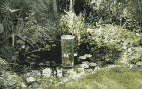

# 德国 Fishloft 让您的鱼比其他鱼更酷 TechCrunch

> 原文：<https://web.archive.org/web/http://techcrunch.com/2006/10/11/german-fishloft-makes-your-fish-cooler-than-the-other-fish/>

# 德国 Fishloft 让你的鱼比其他鱼更酷

哦，伙计，这太酷了。完全无用，但如此如此酷。这是一个鱼阁楼。这是德语…这就是我们所知道的全部。如果你懂德语，你可以登录官方网站来回答你的燃眉之急，比如“什么是最好的鱼店？”

基本上，你可以把它放在池塘里，把空气抽出来，把水抽进去。下一件你知道的事情是，池塘里的居民将过着美好的生活，从上面看着他们的花蕾。

[鱼阁楼](https://web.archive.org/web/20221221204348/http://www.ohgizmo.com/2006/10/11/fish-loft/)【哦小发明！]