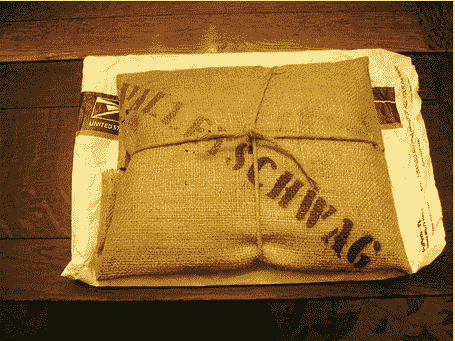

# 从 valley Schwag TechCrunch 获取 Web 2.0 Schwag

> 原文：<https://web.archive.org/web/http://www.techcrunch.com:80/2006/05/04/get-web-20-schwag-from-valleyschwag/>

# 从 Valleyschwag 获取 Web 2.0 Schwag

  当你住在硅谷或参加很多关于创业公司的会议时，施瓦格往往会堆积如山。t 恤、贴纸、钢笔等。我的房子里到处都是公司的标志，有时人们很容易忘记很多人没有机会从他们最喜欢的创业公司获得 schwag。

[Valleyschwag](https://web.archive.org/web/20220927030336/http://www.valleyschwag.com/) 会每月给你寄去 15 美元的包裹，其中包括来自硅谷初创公司的 schwag(这些公司很乐意捐赠)。[拿到这里](https://web.archive.org/web/20220927030336/http://valleyschwag.com/)。第一个包出来了，人们很喜欢它。请注意，Valleyschwag 将进行国际运输，需要额外付费。

