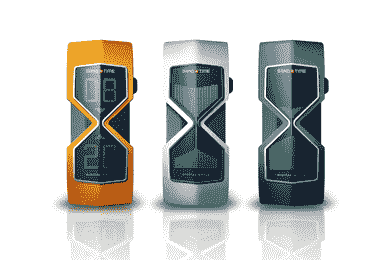

# 逆水行舟:沙盘时间表|技术危机

> 原文：<https://web.archive.org/web/http://techcrunch.com/2007/03/19/go-against-the-grain-the-sand-time-watch/>

# 逆水行舟:沙地时间表

除了欢乐之外，设计师 Pavel Balykin 的 Sand Time Watch 是世界上最令人惊叹的计时器之一。如果你玩了很多需要计时器的图片游戏、方块游戏或其他棋盘游戏，那么这块手表肯定适合你的衣柜。显示屏的特点是时间就像一个基本的时钟一样，但是当进入屏保模式时，手表会变成一个虚拟的沙漏计时器，模拟沙漏底部的沙粒；在这种情况下是一个小玻璃杯。

虽然目前只是一个概念，但这些手表可能会在 2007 年的某个时候上市。如果是这样，您可以用金属橙色、蓝色或银色舀起一个。

[沙盘时间表](https://web.archive.org/web/20230322164148/http://www.popgadget.net/2007/03/sandtime_watch.php)【流行小玩意】