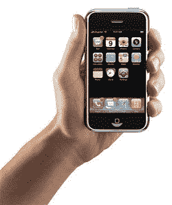

# 高盛称 2009 年售出 1400 万部 iPhones

> 原文：<https://web.archive.org/web/http://techcrunch.com/2007/02/27/goldman-sachs-says-14-million-iphones-sold-by-2009/>

老实说，我没想到苹果会在 2008 年底卖出 1400 万部 iPhones，但我有什么资格支持这样的说法呢？投资公司高盛称，到 2008 年底，苹果将售出超过 1400 万部 iPhones。尽管 1400 万部令人印象深刻，但该公司预测仅在 2007 年就只能售出 400 万部。2008 年是它回升的一年，预计总销量为 1050 万部。

如果你认为成群结队的人会转向 iPhone，那就再想想吧。只有 15%的美国受访者和 30%的英国受访者表示他们会更换运营商。或许 iPhone 终究还是要赢得一些人的支持。

[高盛预测 2008 年底将售出 1400 万部 iPhones】](https://web.archive.org/web/20170707224907/http://ilounge.com/index.php/news/comments/goldman-sachs-sees-sales-of-14-million-iphones-by-end-of-2008/)