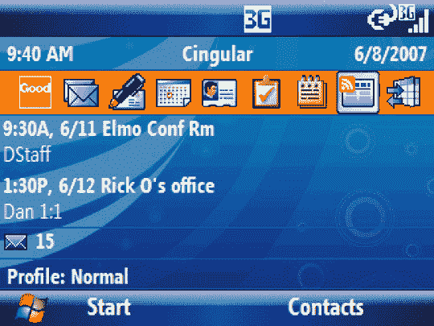

# 好的移动通讯 5:商业用户最好的朋友(就电子邮件而言)

> 原文：<https://web.archive.org/web/http://techcrunch.com:80/2007/06/25/good-mobile-messaging-5-business-users-best-friend-as-far-as-e-mail-goes/>

摩托罗拉去年 1 月收购了 Good Technology Group，现在该公司拥有 Good Mobile Messaging 5。这是一个用于智能手机的软件包，试图移动微软 Outlook 或 Lotus Notes。据我所知，专业人士实际上是在工作中使用电子邮件，而不仅仅是向你的整个地址簿发送有趣的链接，所以保持整洁有序是关键。时间就是金钱；贪婪是好的等等。生意上的事。这个特别的版本增加了一些类似 RSS 阅读器和完全个性化的提醒声音的功能(对商业用户来说)。假设你收到一封来自某个家伙的电子邮件，你会联想到某种声音——一旦他给你发邮件，那种声音就会被激活。商业用户是疯狂的。

也许比任何数量的卡通音效更重要的是安全相关的增强。good 5——这是你住在公园斜坡的中层管理主管的说法——除了锁定应用程序外，还能锁定设备的服务，如 Wi-Fi 和相机(注意，[苹果](https://web.archive.org/web/20160422000010/http://crunchgear.com/2007/06/25/iphone-shipments-arriving-already-protected-by-armed-guards/))。期待今年 9 月的好 5。

[新闻稿](https://web.archive.org/web/20160422000010/http://www.motorola.com/mediacenter/news/detail.jsp?globalObjectId=8333_8263_23)【摩托罗拉】