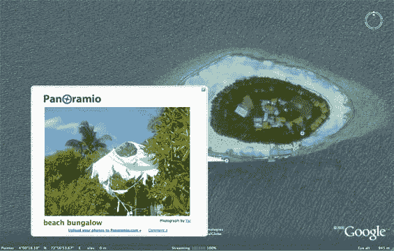

# 谷歌将地理网络添加到地球上

> 原文：<https://web.archive.org/web/http://www.techcrunch.com:80/2006/12/09/google-adds-the-geographic-%20web-to-earth/>

 谷歌给[谷歌地球](https://web.archive.org/web/20080916191146/http://earth.google.com/)增加了一些新图层。新的图层是现在所谓的“地理网络”的一部分

地理网络是来自谷歌地球社区[维基百科](https://web.archive.org/web/20080916191146/http://www.techcrunch.com/tag/Wikipedia/)和地理照片分享网站 [Panoramio](https://web.archive.org/web/20080916191146/http://www.panoramio.com/) 的内容的混搭。当您放大到特定位置时，您可以看到兴趣点的地点标记、用户生成的照片和选定的维基百科文章。希望随着内容的填充，它将保持整洁，但似乎谷歌只使用了地理网络中来自三个用户生成的提要的精选信息。

