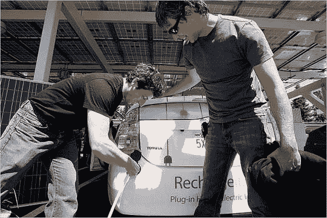

# 谷歌和 PG&E 测试疯狂的新型混合动力汽车

> 原文：<https://web.archive.org/web/http://techcrunch.com/2007/06/19/google-and-pge-test-crazy-new-hybrid-vehicles/>

 我们**发财了！** 
不满足于互联网的霸权统治，谷歌现在正在寻求对开放道路的统治。本周早些时候(阅读:昨天)，谷歌和太平洋煤气&电气测试了一系列混合动力汽车，这可能会彻底改变这个行业(屋顶？).

展出的是六辆丰田普锐斯和福特 Escape 汽车，它们被改装成部分依靠电网供电。这一增加允许车辆一加仑汽油行驶约 75 英里——这大约是目前混合动力车一加仑汽油行驶距离的两倍。

然而，这并不是真正有趣的部分，因为类似的可充电汽车在过去已经存在。真正值得注意的是，车辆可以将能量回馈给电网。虽然这项技术仍处于早期开发阶段，但其想法是电力公司将能够在非高峰时段将电力储存在汽车电池中。然后，当白天电网负荷增加时，该公司可以从汽车中获取能量。当然，这只是一辆车的一小部分，但如果有一大群车，这可能意味着更实际的东西。

另一个很酷的地方是，谷歌将汽车放在了装有太阳能电池的车库里，太阳能电池为汽车充电做出了巨大贡献。我发现这可能是最酷的部分。给汽车充电的太阳能电池对藏在我身体里的肮脏的嬉皮士来说有一种非常吸引人的自给自足。

谷歌和公用事业公司测试卖回电力的混合动力车