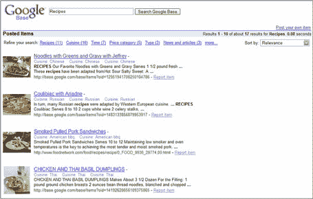

# 谷歌基地启动。呸。

> 原文：<https://web.archive.org/web/http://www.techcrunch.com:80/2005/11/15/google-base-launched-yuck/>

 [谷歌博客](https://web.archive.org/web/20221209123059/http://googleblog.blogspot.com/2005/11/first-base.html)正式宣布[谷歌基地](https://web.archive.org/web/20221209123059/http://base.google.com/)启动。我们之前预计 Google Base(和其他人一起)会在 10 月下旬的发布。

底线:就目前的形式来看，这不是一个非常有趣的应用程序。Keith Teare 说它就像一个功能较少的 1985 年 dBASE 文件。太丑了。它是集中的内容，功能比 ebay 或 craigslist 少。这些内容不会直接整合到谷歌搜索结果中，但“相关性”可以将其提升到主搜索和本地搜索中。

《商业周刊》的罗布·霍夫也对此感到厌烦。他说“易贝和其他国家可能还没什么好害怕的”

关于部分的[中的其他信息和常见问题。](https://web.archive.org/web/20221209123059/http://base.google.com/base/about.html)

[功能:](https://web.archive.org/web/20221209123059/http://base.google.com/base/about.html)

*   **费用:**免费
*   **接受物品类型:**所有类型的线上和线下信息和图片
*   **语言:**您可以提交多种语言的信息；但是，包括帮助内容在内的 Google Base 界面目前只有英语、英国英语和德语版本。
*   **Reach** :你提交到 Google Base 的项目可以在 Google Base 上找到，根据其相关性，也可能出现在 Google、Froogle 和 Google Local 等 Google 属性上。
*   **有何不同:** Google Base 使你能够添加更好地描述你的内容的属性，这样用户就可以很容易地找到它。特定属性变得越受欢迎，当其他人发布相同的项目时，我们就越经常建议它们。同样，越来越受欢迎的项目将在选择现有项目类型下拉菜单中显示为建议的项目类型。

上传数据有两种方式——一次一个项目的 web 界面和一个以 XML 格式发送内容的[批量上传](https://web.archive.org/web/20221209123059/http://base.google.com/base/howtobulkupload.html)选项。

我已经测试过 Google Base 了。总的想法是，你为你的文章选择一个类别。有建议的类别-课程日历，事件和活动，工作，评论，招聘广告等。您也可以创建自己的类别。

每个类别都有自己的字段来简化数据输入。例如，“车辆”类别包括车辆类型、年份、品牌等字段。您可以填写这些字段中的任何一个或全部，如果您愿意，还可以添加其他字段(称为“属性”)，并添加标题、描述和关键字(标签)。您也可以上传图片或指向网页上的图片。

我在这个表单中发现了几个 bug。例如，添加“techcrunch”作为标签失败，因为它“拼写错误”,它根本不会包括它。

一旦我移除了 techcrunch 标签，我就可以添加一个截止日期，并发布我的测试内容，在短暂的延迟后发布，同时发布的还有一个永久 URL(这只是一个快速测试)。

内容发布后，可以从仪表板进行编辑。

也可以在 Google Base 搜索内容。上面的屏幕截图是对“食谱”的[搜索。点击一个特定的项目会弹出它的](https://web.archive.org/web/20221209123059/http://base.google.com/base/search?q=recipes&authorid=&hl=en)[永久 URL](https://web.archive.org/web/20221209123059/http://base.google.com/base/items?oid=16624776744101549062) (示例)，在这里可以查看全部细节并通过电子邮件联系发布的内容。

布莱恩·本辛格对此有一个更积极的评价。看看 [Dave Winer 是怎么说的](https://web.archive.org/web/20221209123059/http://www.scripting.com/2005/11/16.html#allYourBaseBelongToGoogle)(“没有模式的微内容”)。