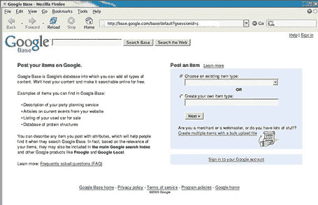

# 谷歌基地即将启动

> 原文：<https://web.archive.org/web/http://www.techcrunch.com:80/2005/10/25/google-base-to-launch/>

有报道称 Google Base 将很快推出，甚至可能就在今天。迪尔森在 Flickr 上有一张[T2 的截图，其他图片在](https://web.archive.org/web/20220626064648/http://www.flickr.com/photos/dirson/55908013/)[沃特·舒特的博客](https://web.archive.org/web/20220626064648/http://www.seweso.com/blog/2005/10/google-base.php)上。

Google Base 似乎是一项直接向 Google 发布内容并让他们以集中方式托管内容的服务。如果是这样，这将完全违背分散出版的加速趋势。

我的预测是:当尘埃落定时，这要么在很大程度上被忽视，要么遭到普遍的厌恶。集中的内容很无聊…这么多事情都发生在网络的边缘，为什么会有人试图把它们都放回中心呢？

[Philipp Lenssen](https://web.archive.org/web/20220626064648/http://blog.outer-court.com/archive/2005-10-25-n57.html) 有更多的细节，包括下面截图中的文字:

> 在谷歌上发布你的物品。
> 
> Google Base 是 Google 的数据库，您可以在其中添加所有类型的内容。我们将托管您的内容，并使其可免费在线搜索。
> 
> 您可以在 Google Base 中找到的项目示例:
> 
> 您的派对策划服务描述
> 您网站上的时事文章
> 您待售的二手车列表
> 蛋白质结构数据库
> 
> 你可以用属性描述你发布的任何物品，这将有助于人们在搜索 Google Base 时找到它。事实上，根据你的项目的相关性，它们也可能被包括在谷歌主搜索索引和其他谷歌产品中，比如谷歌搜索引擎。

**更新:**谷歌产品营销经理 Tom Oliveri 在谷歌博客上发布了一篇关于谷歌基础的[短评:](https://web.archive.org/web/20220626064648/http://googleblog.blogspot.com/2005/10/rumor-of-day.html)

> 你可能已经看过今天的报道，报道了我们正在测试的新产品，并推测了我们的计划。事实是这样的。我们正在测试内容所有者向谷歌提交内容的新方法，我们希望这将补充现有的方法，如我们的网络爬行和谷歌网站地图。我们认为这是一个令人兴奋的产品，当有更多消息时，我们会让您知道。

感谢安东尼。