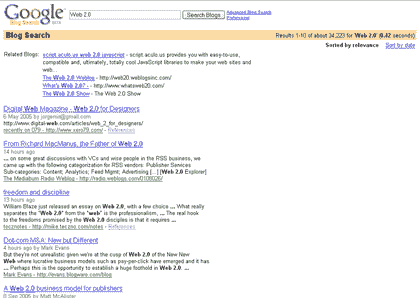

# 谷歌博客搜索-第一印象

> 原文：<https://web.archive.org/web/http://www.techcrunch.com:80/2005/09/14/google-blog-search-first-impressions/>

 [谷歌博客搜索](https://web.archive.org/web/20230324083932/http://blogsearch.google.com/) [昨晚推出](https://web.archive.org/web/20230324083932/http://battellemedia.com/archives/001862.php)并在博客圈掀起风暴。我们已经有机会敲了大半个晚上和早晨，并有一些事情要报告。

总的来说，谷歌博客搜索是一个非常值得加入博客搜索引擎的行列。

## 基础知识

这一搜索完全不同于普通的谷歌搜索。可以通过三种方式访问它，尽管无论如何访问后端服务都是一样的:

高级搜索选项可在[这里](https://web.archive.org/web/20230324083932/http://blogsearch.google.com/blogsearch/advanced_blog_search)查看。

自 2005 年 6 月以来，使用 ping 服务器的博客，如[Weblogs.com](https://web.archive.org/web/20230324083932/http://www.weblogs.com/)([个人资料](https://web.archive.org/web/20230324083932/https://techcrunch.com/?p=75))已经被编入索引，所以旧的帖子不包括在索引中。

该引擎通常只指向文章，尽管如果你对整个博客的查询有很好的匹配，谷歌会指向正常搜索结果上方的博客(见下面的屏幕截图)。

您可以使用高级搜索功能将搜索限制到特定语言(35 种支持的语言)。

更多信息可在[常见问题解答](https://web.archive.org/web/20230324083932/http://www.google.com/help/about_blogsearch.html)中找到。

## 谷歌博客搜索做得好的地方

界面是干净的。发动机无疑很快。大约和普通的谷歌搜索一样快。然而，由于他们的索引只能追溯到 6 月，因此将其与现有的博客搜索引擎进行比较是不公平的。

谷歌通过抓取 XML 提要而不是文章 html 来索引文章。这允许更多的结构化数据(日期、作者、类别等)。).但是，如果 XML 提要只包含文章的摘要(很多人都这样做)，文章的全文就不会被索引(因此无法被搜索)。不会找到相关信息。

速度是一个至关重要的问题，如果他们能够随着时间的推移保持目前的搜索速度，这将是一个非常大的竞争优势。

搜索结果可以按日期或“相关性”排序。默认情况下按相关性排序。

## 有待改进的领域

一些人注意到了当前产品的不足之处。理查德·麦克马努斯说:

> 但是…是只有我，还是谷歌博客搜索相当驯服/蹩脚？我不认为 Technorati 应该放弃它的日常工作，尽管最近在博客圈受到了打击。

大卫·西弗里(Technorati 首席执行官)[给出了更多细节](https://web.archive.org/web/20230324083932/http://www.sifry.com/alerts/archives/000340.html)，他说:

> 我确信在接下来的几个月里他们会继续改进，也许包括标签、最近的图片和链接、时代精神、博客工具和其他类型的半结构化数据。我确信他们也将开始索引博客文章的全文，而不仅仅是大多数博客提要中的部分文本。

总体而言，仍有很大的改进空间。

*   谷歌应该提高相关性——我们的初步测试表明，相关性还有很多不足之处。
*   6 月之前的帖子必须以某种方式包含在内
*   应该显示类别和标签
*   图像和链接应该包括在内
*   应该显示链接帖子
*   除了 XML 提要之外，还应该抓取帖子的完整 html

## 结论

谷歌博客搜索速度很快，根据相关性或日期进行排序的能力是一个重要的特性。然而，谷歌搜索并不像最初的谷歌搜索那样是一个类别杀手。竞争者今天遭受了意料之中的打击，但他们仍然屹立不倒。