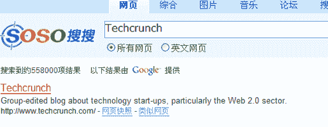

# 谷歌组建团队寻求征服中国

> 原文：<https://web.archive.org/web/http://www.techcrunch.com:80/2007/05/18/google-builds-team-in-quest-to-conquer-china/>

# 谷歌组建团队寻求征服中国

传言已久的谷歌现在正式为中国搜索引擎[Soso.com](https://web.archive.org/web/20210522002525/http://www.soso.com/)提供搜索结果。

最先被[搜索引擎杂志](https://web.archive.org/web/20210522002525/http://www.searchenginejournal.com/google-soso/4937/)发现的谷歌标志现在出现在 Soso.com 的搜索结果中，并加入了[163.com](https://web.archive.org/web/20210522002525/http://www.163.com/)谷歌征服中国的行列。

对谷歌来说，这从一开始就是一个艰难的市场。与审查制度相关的道德问题导致谷歌停止为 Google.cn 提供 gmail 等服务，而在纳斯达克上市的 Baidu.com 继续主导本地搜索市场。

截至 4 月 13 日，百度的市场份额让人想起谷歌在其他国家的统治地位，百度在中国的搜索市场份额为 55%，而谷歌为 21.7%。

谷歌的传统敌人雅虎在中国才刚刚浮出水面。尽管在 2006 年的市场份额报告中被评为中国第三大搜索引擎，但截至 2006 年 6 月的市场份额仅为 5.7%。如果 Alexa 的数据可信的话，[Yahoo.cn](https://web.archive.org/web/20210522002525/http://www.yahoo.cn/)的访问量已经下滑至第七位，落后于 Baidu.com、163.com(谷歌排名第二)、Sohu.com(第三)、Google.cn(第四)、SoSo.com(谷歌排名第五)和 since(第六)。应该指出的是，许多网站，如 Sina.com，不仅在搜索领域竞争，在服务领域也是如此，Sina.com 在西方因提供博客平台而闻名。

谷歌的中国合作伙伴 Soso.com 和 163.com 也使用谷歌的 Adwords 广告平台。谷歌之前持有 Baidu.com 2.6%的股份，并于 2006 年出售。

中国对谷歌的重要性不容小觑。中国约有 1.5 亿网民，预计在未来 12-24 个月内，中国的宽带用户将超过美国。