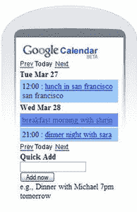

# 谷歌日历移动化

> 原文：<https://web.archive.org/web/http://techcrunch.com:80/2007/05/25/google-calendar-goes-mobile/>

需要在旅途中查看日历？如果你使用谷歌日历，你可以通过 WAP 从你的手机上查看你的活动并维护你的日程安排。谷歌日历团队的好伙计们已经意识到，拥有手机的人比拥有电脑的人多，现在你可以通过手机访问[calendar.google.com](https://web.archive.org/web/20140104212117/http://www.google.com/calendar/m)，了解你的计划。它的工作就像网页版，所以你可以看到细节，如日期，时间，地点，描述和客人名单。

[移动设备日历](https://web.archive.org/web/20140104212117/http://googleblog.blogspot.com/2007/05/calendar-for-mobile-devices.html)【通过谷歌官方博客】