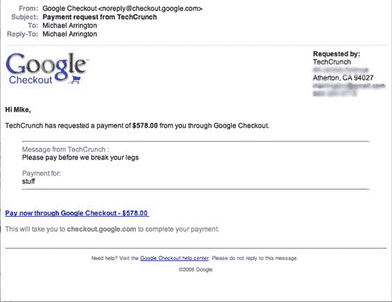

# Google Checkout 推出新功能并免除费用 

> 原文：<https://web.archive.org/web/http://www.techcrunch.com:80/2006/11/11/google-checkout-rolling-out-features-and-waiving-fees/>

# Google Checkout 推出新功能并免除费用

 谷歌似乎对他们的小[贝宝杀手](https://web.archive.org/web/20230202234605/http://techcrunch.com/2006/06/29/google-checkout-offers-low-cost-transactions-for-sellers-whats-in-it-for-me/)相当认真，并正在发布一系列稳定的新功能，似乎是为了满足商家的需求。这是一个产品，自从发布以来，我们一直在稳定地使用它来向活动赞助商收费。它有一些小问题，特别是在一些过于激进的欺诈控制措施取消了一些交易的情况下，但总体来说，我们对这款产品很满意，它比 PayPal(我们用于我们的 [CrunchBoard 工作板](https://web.archive.org/web/20230202234605/http://www.crunchboard.com/))为付款人提供了更少干扰的结账体验。

最近的两个新功能——一个[优惠券创建器](https://web.archive.org/web/20230202234605/http://googlecheckout.blogspot.com/2006/10/new-feature-coupon-creator_27.html)和一个[电子邮件发票产品](https://web.archive.org/web/20230202234605/http://googlecheckout.blogspot.com/2006/11/new-feature-email-invoices.html)——几乎可以肯定是客户反馈的结果。我们今天晚上测试了电子邮件发票产品——它允许任何金额的快速发票发送到一个电子邮件地址。付款人不需要有 Gmail 帐户来支付发票。它还允许快速，一次性向客户收费。以前，必须为固定金额创建结账按钮，这样可以很容易地向多个买家反复收取相同的价格，但很难用于一次性收费。这解决了那个问题。

谷歌还将在年底前免除所有交易费用(每笔交易 2.0%外加 0.20 美元)，这是一项营销举措，旨在为假日季吸引新的商家。

我们有第一手的和正在进行的处理贝宝和谷歌结账的经验。当我们不得不就问题联系谷歌时(例如可疑的欺诈)，我们得到了智能客户服务，问题很快得到解决。另一方面，联系贝宝客户支持简直是一场噩梦。自动回复地狱，接着是没有解决我们问题的固定回复，接着是沉默。

如果你是一个运送实物商品的商家，不想处理设置商家账户和集成结账软件的麻烦，Google Checkout 是一个非常好的产品，肯定比 PayPal 提供的要好。谷歌的费用也明显低于贝宝(在处理退货时，他们还会退还大部分费用，而贝宝收取两倍的处理费)。

