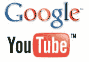

# 谷歌完成收购 YouTube

> 原文：<https://web.archive.org/web/http://www.techcrunch.com:80/2006/11/13/google-closes-youtube-acquisition/>

谷歌今天宣布，他们已经完成了之前宣布的对 YouTube 的[收购。](https://web.archive.org/web/20230307214228/https://techcrunch.com/2006/10/09/google-has-acquired-youtube/)

最终价格包括 1500 万美元现金、3217560 股谷歌 A 类普通股，以及另外 442210 股限制性股票和认股权证。股票数量由收购价格 16.5 亿美元除以过去 30 天谷歌股票的平均价值确定(这是处理上市公司收购的标准方式)。12.5%的股票将被托管一年。

根据今天每股 481.03 美元的收盘价，这笔交易对 YouTube 的股东来说已经价值 17.75 亿美元。

> 加州山景城，2006 年 11 月 13 日——谷歌公司(NASDAQ: GOOG)
> 今天宣布，它已经完成了对 YouTube 的收购，YouTube 是一家为人们观看和分享原创视频的
> 消费媒体公司。
> 与收购相关，谷歌发行了总计
> 3，217，560 股股票，以及总计
> 谷歌 A 类普通股的可行使或可转换为 442，210 股股票的限制性股票单位、期权和认股权证
> 。谷歌已发行和可发行的 A 类普通股
> 的数量是通过将 16.5 亿美元减去谷歌在签署和收盘之间向
> YouTube 提供的特定金额(约 1500 万美元)除以截至 2006 年 11 月 9 日的 30 个交易日的平均收盘
> 价格计算的。交易中已发行和可发行的股权的 12.5%将由
> 托管一年，以确保某些赔偿义务。
> 
> 谷歌首席执行官埃里克·施密特说:“我们很高兴完成了收购，以便开始合作，为我们的合作伙伴提供质量和深度最好的内容、用户体验和新的商业机会。”。“YouTube 和谷歌将一起为我们的用户提供创新和令人兴奋的服务，这将为在线媒体娱乐增加一个新的维度。我们期待与大大小小的内容创作者和所有者合作，利用互联网的力量来推广、分发和盈利他们的内容。”
> 
> “谷歌的专业知识、技术领先地位和资源将为我们提供在互联网上创新和构建最好、最具娱乐性的服务的灵活性。在接下来的几个月里，我们将
> 推出许多令人兴奋的新功能和节目，以利于我们社区的
> 创造力和参与，”首席执行官
> 兼 YouTube 联合创始人查德·赫利说。“社区仍将是 YouTube 最重要的部分，我们将继续走近一年前开始的道路。我们将继续收集和听取它的反馈，并期待着未来的许多机会。”