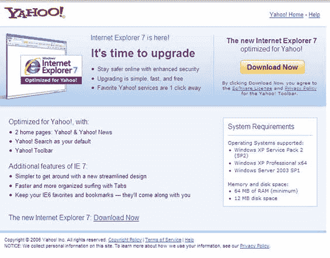
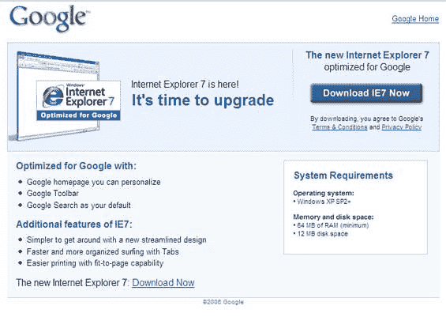

# 谷歌从雅虎 TechCrunch 复制 IE7 推广材料

> 原文：<https://web.archive.org/web/http://www.techcrunch.com:80/2006/12/11/google-copies-ie7-promo-material-from-yahoo/>

# 谷歌从雅虎复制 IE7 推广材料

雅虎和谷歌推出了新的 Internet Explorer 7 浏览器的个性化版本。雅虎的在这里可以下载[，谷歌的版本在这里](https://web.archive.org/web/20220528021415/http://downloads.yahoo.com/internetexplorer/index.php)可以下载[。](https://web.archive.org/web/20220528021415/http://www.google.com/toolbar/ie7/)

两个网站的页面布局和内容几乎相同，尽管这可能是从推荐的微软促销信息中简单的剪切和粘贴。更有趣的是，两个图片中显示 IE7 的屏幕截图也是相同的。雅虎版本清楚地显示雅虎工具栏，带有一个大的红色 Y！在左边的角落。谷歌快照包含相同的图像，带有红色的 Y！有点模糊了。谷歌截图显示 IE7 带有雅虎工具栏。截屏和谷歌模糊 Y 的放大图！都在下面。

这很可能是微软粗心大意，向谷歌发送了雅虎复制的材料。或者谷歌只是抄袭了雅虎网站上的材料。不管怎样，在不久的将来，你会看到[谷歌网站](https://web.archive.org/web/20220528021415/http://www.google.com/toolbar/ie7/)的更新。
 ***更新:**Yahoo ' er[Jeremy Zawodny](https://web.archive.org/web/20220528021415/http://jeremy.zawodny.com/blog/archives/008122.html)也有类似帖子。也许我们有同一个匿名线人。*

***更新:** [谷歌在晚上 11 点替换了有问题的网站](https://web.archive.org/web/20220528021415/http://www.beta.techcrunch.com/2006/12/11/google-fixes-yahoo-copied-splash-page/)，就在这个故事爆出后的 6 个小时。*

