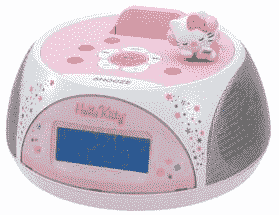

# 谷歌要求你在撒尿时保持高效

> 原文：<https://web.archive.org/web/http://techcrunch.com/2007/01/23/google-demands-you-stay-productive-while-peeing/>

# 谷歌要求你在小便时保持高效

在谷歌的山景城洗手间里发现的这个大 G，似乎是想让你在抽干主要血管的同时保持敏锐。

[山景城高效的厕所休息时间](https://web.archive.org/web/20130628184335/http://valleywag.com/tech/google/mountain-views-productive-restroom-breaks-230548.php)