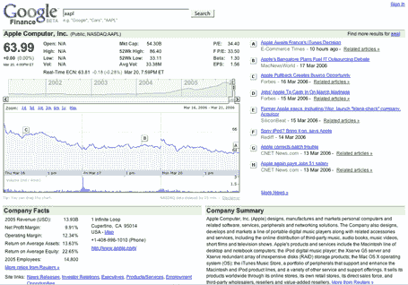

# 谷歌金融——大量 Flash 和 Ajax

> 原文：<https://web.archive.org/web/http://www.techcrunch.com:80/2006/03/21/google-finance-lots-of-flash-ajax/>

# 谷歌金融——大量的 Flash 和 Ajax

  传言是谷歌在今天[发布](https://web.archive.org/web/20220516091648/http://googleblog.blogspot.com/2006/03/spring-is-season-for-love-and-data.html)之前，通过两个完整版本内部测试了[谷歌金融](https://web.archive.org/web/20220516091648/http://finance.google.com/)，额外的关注可见一斑。总的来说，这是一款很棒的产品。他们至少比目前形式的雅虎财经更进了一步。

包含的信息类似于雅虎上市公司财务(可以从公开的 SEC 报告和公司相关新闻中搜索到的内容)，但有一些关键的新功能:

*   使用 Flash 制作[图表](https://web.archive.org/web/20220516091648/http://finance.google.com/finance?q=aapl&btnG=Search&hl=en)来动态改变时间轴等功能；拖放以向后移动时间
*   在[主页](https://web.archive.org/web/20220516091648/http://finance.google.com/)上使用 Ajax 在市场视图(纳斯达克、纽约证券交易所等)之间切换。)
*   包含与公司相关的最新博客条目(请参见上面第一个项目符号中的链接)
*   [私人公司](https://web.archive.org/web/20220516091648/http://finance.google.com/finance?q=linkedin&btnG=Search&hl=en)信息

flash 图表现在加载非常慢，我认为这种情况会有所改善。上面的最后一点非常有趣——他们为私人公司创造了一些原创内容，并从网上索引了更多内容。谷歌金融信息也将显示在上市公司普通搜索结果的顶部，他们称之为一个框区。

Om 说谷歌金融令人失望，比雅虎上的“我也是”好不了多少。但在这种情况下，我不同意，并很高兴向谷歌点头——除了非常缓慢的 Flash 图表，我喜欢它，我认为这将推动雅虎推进其自身的金融资产。

更多关于谷歌金融的信息，请访问[约翰·巴特利](https://web.archive.org/web/20220516091648/http://battellemedia.com/archives/002437.php)、 [SEW](https://web.archive.org/web/20220516091648/http://searchenginewatch.com/searchday/article.php/3592876) 和 [Memeorandum](https://web.archive.org/web/20220516091648/http://tech.memeorandum.com/060321/p2#a060321p2) 。

