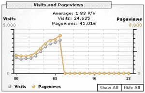
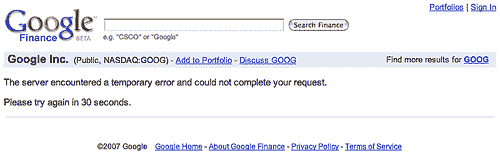

# 又是谷歌平板电话

> 原文：<https://web.archive.org/web/http://www.techcrunch.com:80/2007/02/02/google-flatlines-again/>

今天早上，一些谷歌服务似乎出现了问题。我们昨晚首次注意到，我们的[谷歌分析](https://web.archive.org/web/20220816073311/http://google.com/analytics)账户自昨天上午 9 点以来没有报告任何新数据，但分析在接收更新方面通常是出了名的慢。今天早上，我们的分析数据没有进一步的更新，除此之外，我们还听到报告称，谷歌金融和 Gmail 过去和现在都存在问题。下面是昨天 Google Analytics 发布的 Techcrunch 统计数据的截图，显示记录的点击率突然下降。

似乎中断影响了谷歌服务器的一个子集，而且只有那些负责收集分析数据并为一些用户提供金融和 Gmail 服务的服务器。尽管谷歌拥有巨大的容量，并计划在全国范围内建立多个新的大型数据中心，但他们仍不时会遇到一些服务中断的情况。谷歌如此之大，如此之受欢迎，以至于即使是最轻微的中断或问题都能在网络上感觉到。自从免费向所有人开放注册以来，谷歌分析已经成为一项非常受欢迎的服务，尤其是在博客中。快速浏览一下 [Technorati](https://web.archive.org/web/20220816073311/http://technorati.com/search/google+analytics) 或 [Google Blogsearch](https://web.archive.org/web/20220816073311/http://blogsearch.google.com/blogsearch?hl=en&q=google%20analytics&ie=UTF-8&scoring=d) 的结果，可以看到大量博客作者在过去几个小时内报告了服务中断的情况。

[搜索引擎圆桌会议](https://web.archive.org/web/20220816073311/http://www.seroundtable.com/archives/007381.html)是第一批报告谷歌财务问题的组织之一(见下面的截图，由他们的帖子提供)

GigaOm[也报告了服务中断](https://web.archive.org/web/20220816073311/http://gigaom.com/2007/02/02/random-outages-hitting-google/)，但至今还没有来自谷歌的官方消息，也没有来自任何[谷歌博客](https://web.archive.org/web/20220816073311/http://googleblog.blogspot.com/)或[博客](https://web.archive.org/web/20220816073311/http://www.mattcutts.com/blog)的官方消息。分析受到影响已经超过 24 小时了，其他问题似乎是随机的。如果你有任何关于其他谷歌服务中断的消息，或者如果你知道哪里出错了，请在这里留下评论。我们将继续努力找出发生了什么，并从谷歌得到官方消息。

**更新**:其他谷歌服务似乎也停止了，[即谷歌新闻](https://web.archive.org/web/20220816073311/http://blog.outer-court.com/archive/2007-02-01-n22.html)(谷歌博客上的故事和截图)和用户对 Blogger 有问题(从我们下面的评论来看，[见这里的错误页面](https://web.archive.org/web/20220816073311/http://img396.imageshack.us/img396/2876/bloggered5.gif))。谷歌分析博客[有一个帖子说系统正在进行维护](https://web.archive.org/web/20220816073311/http://analytics.blogspot.com/)，用户应该能够在“一天结束前”看到他们所有日期的完整更新(假设他们指的是美国西部时间)。截至下午 6:40，Analytics 中仍然没有正在收集的数据。

与谷歌新闻出版商合作的 Andrew gird wood[报告称，谷歌新闻的推荐已经停止](https://web.archive.org/web/20220816073311/http://blog.arhg.net/2007/02/arhg-google-news.html)，极大地影响了他们网站的流量。[这个博客有 Blogger 问题的时间表](https://web.archive.org/web/20220816073311/http://oakleafblog.blogspot.com/2007/02/googles-blogger-bx-vjhbsj-meltdown.html)，还有截图。

似乎许多不同的服务都受到了影响，每个人的分析都受到了影响，但对于 Gmail、Blogger、Finance 和 News，我们不确定有多少用户受到了影响。我们最新的检查显示所有这些服务都是实时的(虽然有时很慢——非常不友好)

**更新 2** :截至太平洋标准时间下午 7 点，谷歌分析似乎为 TechCrunch 恢复了数据，但其他人仍在经历停电。