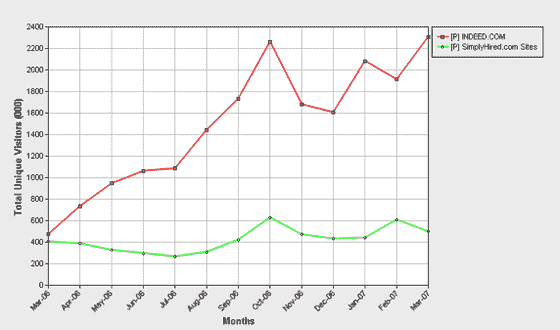

# 谷歌正在谈判收购 SimplyHired | TechCrunch

> 原文：<https://web.archive.org/web/http://www.techcrunch.com:80/2007/05/04/google-in-talks-to-acquire-simplyhired/>

# 谷歌正在谈判收购 SimplyHired

  今天有传言称，谷歌正在讨论收购求职搜索引擎[并雇佣了](https://web.archive.org/web/20230223125530/http://www.simplyhired.com/)。全球股票研究公司的研究分析师 Trip Chowdry 首先谈到了这个问题，然后这个故事被 [Alarm:Clock](https://web.archive.org/web/20230223125530/http://www.thealarmclock.com/mt/archives/2007/05/google_negotiat.html#Permalink) 报道。

我与 Simply 雇佣的总裁 Dion Lim 进行了交谈，他证实了许多方面“对我们很感兴趣”,但没有直接评论传闻中的交易。

最近，《简单雇佣》从新闻集团筹集了 1350 万美元,据传估值低于 4000 万美元。该公司总共筹集了 1770 万美元。Lim 说新闻集团不能阻止第三方收购。

“简单雇佣”直接与另一个由《纽约时报》部分资助的求职搜索引擎“T9”竞争。

康姆斯克表示，这实际上比单纯雇佣要大得多，uniques 每月有 230 万人，而单纯雇佣只有 50 万人。然而，来自 Simply Hired 的两个主要分销渠道 MySpace 和 LinkedIn 的流量并没有反映在康姆斯克的流量数据中。图表在下面。

