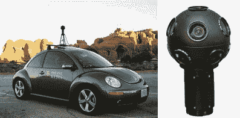

# 谷歌地图的缩放魔法被揭开

> 原文：<https://web.archive.org/web/http://techcrunch.com:80/2007/05/31/google-maps-zoom-magic-uncovered/>

出现在谷歌地图上的新的[街景](https://web.archive.org/web/20161105085354/http://crunchgear.com/2007/05/30/google-maps-intros-street-view/)功能相当不错，但是他们是怎么做到的呢？它让我浑身起鸡皮疙瘩，如果它出现在我周围，我会又踢又叫。这是[将](https://web.archive.org/web/20161105085354/http://crunchgear.com/2007/05/30/google-maps-lets-you-peep-into-homes/)放大到人们的家庭和一切。这明显侵犯了我的隐私。

那么是谁在做这一切呢？沉浸式媒体是罪魁祸首，他们这样做的方式非常可笑。一辆大众甲壳虫？说真的。不管怎样，甲虫正带着一个 11 面摄像机四处巡游，捕捉你正在做的任何事情。既恐怖又酷。你不觉得吗？

谷歌地图缩放:这是它后面的设备和车辆