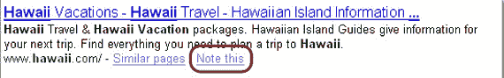

# 谷歌笔记本发布:呵呵——TechCrunch

> 原文：<https://web.archive.org/web/http://www.techcrunch.com/2006/05/16/google-notebook-launches/>

  你不再需要看[预发布截图](https://web.archive.org/web/20220522022340/http://www.beta.techcrunch.com/2006/05/11/google-notebook-screen-shots/):谷歌笔记本现已在[google.com/notebook](https://web.archive.org/web/20220522022340/http://www.google.com/notebook)直播。

正如我在[之前的帖子](https://web.archive.org/web/20220522022340/http://www.beta.techcrunch.com/2006/05/11/google-notebook-screen-shots/)中提到的，谷歌笔记本是 Del.icio.us 的直接竞争对手。你可以通过普通的谷歌搜索(点击搜索结果底部的“注意这一点”链接)，或者在带有 IE 或 Firefox 扩展的开放网站上(突出显示文本，右键单击)，为内容(网页或网页上的一段内容)添加书签。

将内容加入书签后，您可以添加注释并对其进行分类。不支持标记(并且每个项目没有多个类别)。然而，我喜欢整洁的拖放式 Ajax 界面来组织书签。

可以创建多个笔记本，并且可以公开其中的任何一个或所有笔记本。有一个搜索功能，可用于搜索您自己的笔记本或所有公共笔记本。

**但是……**

缺少标记很重要:能够标记一段内容以使未来的搜索更容易是很自然的——不清楚为什么谷歌不支持这种经过验证的描述书签的模型。

我最后的想法是:谷歌笔记本会取得一定程度的成功，只是因为它与谷歌相关联，并直接内置于搜索结果中。就像 Aim Pages 一样，我不认为这是一款特别有创意的产品，或者如果没有谷歌的支持，我不会给它太多机会。Del.icio.us 对谷歌来说是一次完美的收购，因为它的用户界面非常像谷歌。不管出于什么原因，他们让它去了雅虎。我怀疑随着时间的推移，他们会后悔那个决定。

我也对谷歌致力于自己的项目感到好奇。比如现在谷歌记事本已经推出了[谷歌书签](https://web.archive.org/web/20220522022340/http://www.beta.techcrunch.com/2006/01/30/bookmarks-integrated-into-google-toolbar/)的命运会是怎样？[谷歌实验室](https://web.archive.org/web/20220522022340/http://labs.google.com/)散落着半成品和半成品。我很少或根本没有看到谷歌的产品愿景，坐拥 Adsense 收入。

T3
