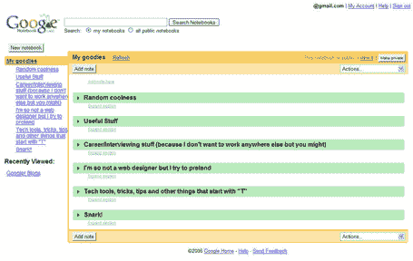
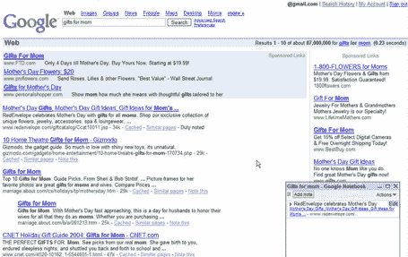
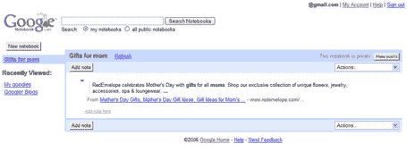
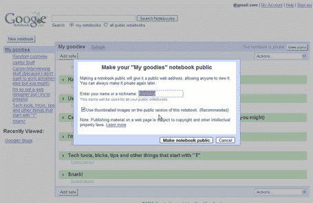

# 谷歌笔记本截屏——TechCrunch

> 原文：<https://web.archive.org/web/http://www.techcrunch.com:80/2006/05/11/google-notebook-screen-shots/>

# 谷歌笔记本屏幕截图

一位名为 Erica Joy 的谷歌员工发布了一系列谷歌笔记本的屏幕截图，这些截图将于下周在 google.com/notebook.发布

Notebook 看起来像是被设计成一个完全的 del.icio.us 竞争对手，允许你从网络上收集内容，添加像类别这样的元数据，如果你愿意，还可以发布信息。菲利普·伦森的更多报道。

**屏幕截图:**

