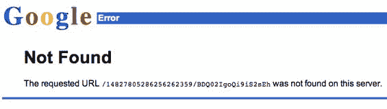

# 谷歌笔记本:使用隐私选项——TechCrunch

> 原文：<https://web.archive.org/web/http://www.techcrunch.com:80/2006/12/27/google-notebook-use-the-privacy-option/>

# 谷歌笔记本:使用隐私选项

  看起来一些使用[谷歌笔记本](https://web.archive.org/web/20220810112836/http://www.google.com/notebook)的人正在用书签标记敏感的个人信息，包括社会安全号码和电子邮件密码。其他人通过谷歌笔记本[搜索工具](https://web.archive.org/web/20220810112836/http://www.google.com/notebook/search)找到这些敏感信息。

这一切都在 Digg 帖子的评论中表现出来了。令人惊讶的是，谷歌笔记本默认隐私，用户必须明确选择通过搜索获得信息。谷歌可能对这些信息没有责任，尽管其中一些看起来是第三方的个人信息，他们把这些信息放在自己的服务器上。我们将会看到他们是否开始审查这些东西以避免责任。

我们之前对谷歌笔记本的报道是[这里](https://web.archive.org/web/20220810112836/http://www.beta.techcrunch.com/2006/05/11/google-notebook-screen-shots/)和[这里](https://web.archive.org/web/20220810112836/http://www.beta.techcrunch.com/2006/05/16/google-notebook-launches/)。
 ***更新:**是的，看起来谷歌开始删除一些从 Digg 帖子链接的敏感内容:*

