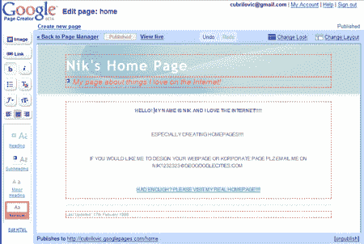

# 谷歌页面发布——技术危机

> 原文：<https://web.archive.org/web/http://www.techcrunch.com:80/2006/02/22/google-pages-released/>

虽然还没有正式宣布，但谷歌 T2 已经发布了期待已久且传言已久的谷歌页面 T4(与克隆拉里佩奇无关)。Pages 允许用户使用 AJAX 界面创建网页，消除了许多与使用 HTML 和其他桌面设计应用程序创建网页相关的“痛苦”。如果您有时间想尝试一下，请前往[http://pages.google.com](https://web.archive.org/web/20220703022259/http://pages.google.com/)注册。如果您有一个现有的谷歌帐户(他们偷偷把它放在我们身上，不是吗)，那么获得一个 pages 帐户非常简单。

一旦你进入应用程序，你会看到一个所见即所得的界面，显示你的页面和一些编辑控件。就他们使用客户端 Javascript 所做的工作而言，这个界面令人印象深刻；就简单页面的设置而言，谷歌所做的工作很酷，但总的来说，这是一个不起眼的小花招，如果他们专注于此，可能会有一些潜力。谷歌页面允许你上传文件，创建许多你可以链接的页面，并从大量模板中选择。你可以推出去发布的网站可以在 username.googlepages.com 找到。

我浏览并创建了自己的页面，可以在[http://cubrilovic.googlepages.com](https://web.archive.org/web/20220703022259/http://cubrilovic.googlepages.com/)找到。复古的外观证明了给你的内容创建者太多的控制权而没有把他们更紧密地包装成一个好的模板的问题。它通常与真正的网站设计一起使用的方式是，设计将内容创建者完全包装起来，这样他们就不会把事情搞砸——只是因为我们并不都是有创造力的类型。不过，谷歌页面确实允许你上传任何文件，并给了你 100 兆字节的空间，有些人可能会发现这对于共享文件或分发 [SNL](https://web.archive.org/web/20220703022259/http://www.nytimes.com/2006/02/20/business/media/20youtube.html?ex=1298091600&en=06f4e30a6c8e7da2&ei=5090&partner=rssuserland&emc=rss) 视频更有用。

例如，这不会威胁到在 MySpace 上创建页面的年轻人，也不会威胁到已经在线的数百万博客用户，更不会威胁到在功能和能力上更胜一筹的 T2 CMS 领域的玩家。我不确定这是针对谁的，因为小企业主和非技术人员肯定不会考虑谷歌的网站解决方案，并考虑到目前没有域名映射，作为一家企业，分发 googlepages.com 域名只是，嗯，*尴尬*。

我不认为我们会看到页面托管的严肃网站数量激增，但这可能是向小型企业 CMS 套件迈出的一步，该套件将包括某种形式的超级博客，以及免费域名注册或 [Office Live](https://web.archive.org/web/20220703022259/http://officelive.microsoft.com/) 将提供的其他一些功能。我只是忍不住想，这个产品感觉没有重点，不够发达——尤其是来自谷歌这样的公司。

更新:在我发布这篇文章的几分钟后，谷歌关闭了这个网站。我希望我没有丢失我所有的工作。

