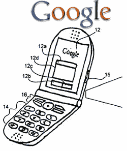

# 谷歌手机:2007 年底前在这里？TechCrunch

> 原文：<https://web.archive.org/web/http://techcrunch.com:80/2007/04/18/google-phone-here-before-the-end-of-2007/>

# 谷歌手机:2007 年底前在这里？

暂时停止你的生活，因为我们有一个传言中的谷歌手机的可能发布日期:2007 年末。据推测，这款手机将由 HTC 制造(他们制造 Dash 等)，该公司将拥有超过 100 万部谷歌手机(GPhones？)到年底。这条新闻是通过台湾科技报纸《电子时报》(DigiTimes)传到我们这里的，这份报纸经常出错。

据说这款手机不会支持 GPS，但会支持 EDGE (lame)，并将集成 Gmail 和谷歌可爱的搜索。这张图来自一份专利申请，而不是我在当地温迪快餐店的餐巾纸上画的。

突破:谷歌手机将于 2007 年推出