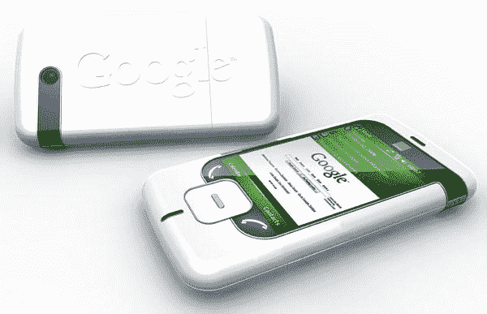

# 谷歌手机原型给制造商；提供免费服务？

> 原文：<https://web.archive.org/web/http://techcrunch.com/2007/08/08/google-phone-prototypes-to-manufacturers-to-offer-free-service/>

# 谷歌手机原型给制造商；提供免费服务？

谷歌显然对向消费者收费有异议。让我们面对现实吧，世界上最大的搜索巨头不是搜索引擎，而是广告机器。一个完美的目标:你告诉它你在找什么，它会提供商业选项供你阅读。这是个好主意。
 有小道消息称，如果或当谷歌手机发布时，这种模式将是相似的。你将在手机上获得免费服务，尽管它会带有谷歌广告。

还不错，真的。更多的谣言说，谷歌正在制造商周围购买它的原型，试图获得一个甜蜜的生产协议。如果手机足够便宜，而且服务免费，谁不会跳槽呢？

不仅仅是通话:iPhone 听起来像垃圾，但人们渴望它的其他功能。很公平，但它证明了一点，随着我们继续使用无线数据，语音通话将让位于许多用户的数据应用程序，这对我们这些书呆子来说太好了。

[谷歌向制造商展示手机原型](https://web.archive.org/web/20130628173424/http://www.ministryoftech.com/2007/08/03/google-showing-phone-prototype-to-manufacturers/)【技术部】