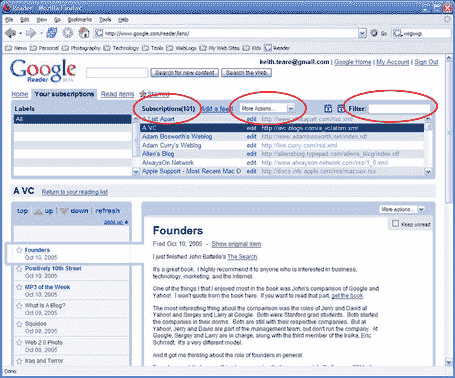

# 谷歌阅读器——我批评得太快了吗？

> 原文：<https://web.archive.org/web/http://www.techcrunch.com:80/2005/10/10/google-reader-was-i-too-quick-to-criticize/>

我们在周末写了关于 [谷歌阅读器](https://web.archive.org/web/20220121204851/http://www.google.com/reader)的文章，并给出了我认为事实上正确的产品评论。然而，我收到的一些帖子评论和几封电子邮件表明，我的一些批评是不中肯的。我今天又看了一眼，我必须说我在几个问题上完全错了。

我复制了下面的“需要改进的地方”,并对不正确的文字进行了加粗:

> 正如我上面提到的，Google Reader 的目标是重度 RSS 读者。然而，该产品对于有效地浏览大量提要并不有用。
> 
> 文章是按照“相关性”的顺序排列的(这似乎并没有以任何相关的方式进行排序)，或者是按照日期排列的。**我需要在个人博客下对帖子进行分组，因为我会先阅读一些订阅源——谷歌阅读器不允许我这样做，我很难找到我最喜欢阅读的作者。** **已经订阅的提要中没有搜索功能，所以无法找到该内容。**
> 
> 读者反应迟钝。向下翻页会导致长时间的不可接受的延迟。顺便说一下，导入我的 OPML 列表需要大约 10 分钟。因为这是一次性成本，所以没什么大不了的。
> 
> 因为这只是一个基于网络的阅读器，所以没有同步。
> 
> Google 用 ajax 代替框架。虽然框架是一项古老的技术，但使用它的阅读器允许多个滚动条-这意味着你可以在滚动单个帖子时保持提要框架锁定。这需要解决。
> 
> **订阅源没有退订按钮。**
> 
> 谷歌阅读器针对火狐浏览器进行了优化。它在其他浏览器上还不能正常工作。

这三个不确定性是:

*   不按进纸分类(v. post)
*   提要中没有搜索功能
*   没有取消订阅按钮

快速浏览一下突出显示在阅读器顶部的“我的订阅”链接，可以看到所有这些功能都包括在内，而且实际上运行得相当好。

在这个选项卡下，可以显示提要，可以对提要进行排序(下面的第二个圆圈)，可以删除提要，也许最重要的是，可以使用“过滤”功能对提要进行搜索(第三个圆圈)。点击任何一个特定的提要都会在底部窗口显示相关的文章。它实际上是一个非常好的直观用户界面。

谷歌阅读器仍然慢得令人痛苦，但这些我以前错过的功能使它成为一个有竞争力的产品。在我看来,“我的订阅”选项卡应该可以选择作为主页，减少必要的点击次数。