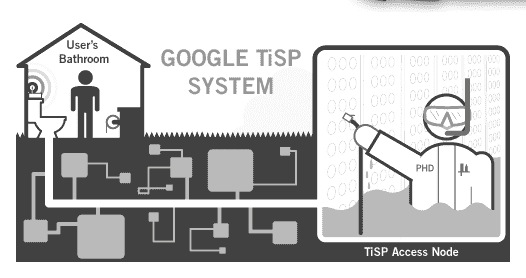

# 谷歌真的很重视 4 月 1 日 TechCrunch

> 原文：<https://web.archive.org/web/http://www.techcrunch.com/2007/04/01/google-really-takes-april-1-seriousy/>

谷歌在愚人节玩笑上花了很多时间，它们通常围绕新产品展开。去年，我们见证了谷歌罗曼史的发布。今年，他们有两个可靠的假产品发布:谷歌 TiSP(免费宽带服务)和谷歌纸(在纸上打印出 Gmail 并发送给你)。

除了 TiSP 和纸之外，请参见[谷歌作家](https://web.archive.org/web/20221208072952/http://googlesystem.blogspot.com/2007/03/google-writer.html)，这是谷歌操作系统博客发明的一款产品，将为用户处理写作的大部分创意部分。
 **谷歌 TiSP**

 [谷歌 TiSP](https://web.archive.org/web/20221208072952/http://www.google.com/tisp/) 是一项免费的、自行安装的免费家庭无线宽带服务。当然，这是不言而喻的，但是它是通过穿过当地市政污水管道的光缆来运行的。

其中的要求是“一个圆形或细长的马桶，每次冲水至少能提供 1.0 加仑的水”，尽管幸运的是“支持 TiSP 的光纤电缆不会干扰你的马桶的正常运行。”该服务是免费的，并支持广告:

> 我们使用通过对您的个人身体输出进行谨慎的 DNA 测序收集的信息来显示在线广告，这些广告与您的烹饪偏好、当前的健康状况以及未来发展特定健康状况的可能性相关。

至少在美国，粪便学的引用总是很容易让人发笑。

 **谷歌论文**

 [谷歌论文](https://web.archive.org/web/20221208072952/http://mail.google.com/mail/help/paper/more.html)是 Gmail 主页上正在推广的一项新功能。你可以点击一个按钮，要求任何电子邮件的物理副本，谷歌将在 2-4 天内通过邮件向你发送纸质打印件。

像 TiSP 一样，谷歌论文也是免费的，并且支持广告。在这种情况下，“相关的、有针对性的、不引人注目的广告”将出现在打印的电子邮件背面，“以红色、粗体、36 磅 Helvetica 字体显示”很好。

谷歌还承诺谷歌纸对环境有益。“Gmail 纸是由 96%的消费后有机大豆痰制成的，因此，实际上有助于环境保护。我们每生产一篇 Gmail 论文，环境就会变得越来越健康。”

在 Gmail 与雅虎争夺最佳网络邮件产品的竞赛中，这是一个极好的补充。顺便说一下，Gmail 本身实际上是在 4 月 1 日推出的。