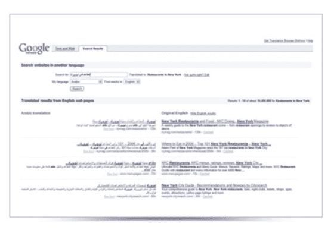

# 谷歌将推出跨语言搜索引擎；查询和结果的即时翻译

> 原文：<https://web.archive.org/web/http://www.techcrunch.com:80/2007/05/16/google-to-launch-cross-language-search-engine/>

# 谷歌将推出跨语言搜索引擎；查询和结果的即时翻译

谷歌工程副总裁乌迪·曼伯(前亚马逊 A9 首席执行官)刚刚在[搜索活动](https://web.archive.org/web/20220315052514/http://www.beta.techcrunch.com/2007/05/16/searchology-event-at-google-today/)上宣布，谷歌将“很快”推出跨语言搜索引擎。上面是用户界面的屏幕截图。

为了返回更多结果，查询将被自动翻译成其他语言以检索更多结果，然后所有结果将被翻译回原始查询语言。目标是为查询返回更多的结果，尤其是用不太流行的语言完成的查询。

该屏幕截图质量极差(我道歉)，但它在左边显示阿拉伯语结果，在右边显示从英语结果翻译过来的结果。