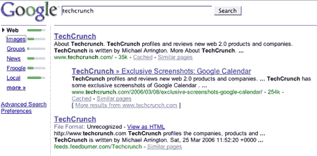
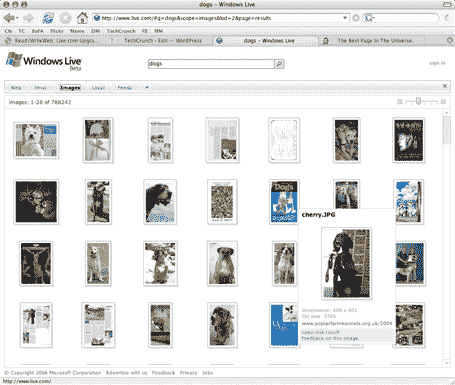

# 谷歌诉微软:新的搜索界面

> 原文：<https://web.archive.org/web/http://www.techcrunch.com:80/2006/03/28/google-v-microsoft-new-search-interfaces/>

谷歌和微软都有新的测试版搜索界面。

谷歌正在测试一个新的“绿色条”界面，位于搜索结果的左侧，允许轻松链接到网络、图片、群组、froogle 和本地的搜索结果。绿色条表示结果计数。

微软通过[Live.com](https://web.archive.org/web/20220522113047/http://www.live.com/)正在测试一个新的搜索界面，它包括每个搜索的 RSS 源，一个非常不同的图片搜索(大量的缩略图结果)和一个“无限滚动条”,当你向下滚动搜索结果时，它会继续刷新。我已经在这里写了新 Live.com 搜索[。](https://web.archive.org/web/20220522113047/http://www.beta.techcrunch.com/2006/03/08/new-look-features-for-livecom/)

任何访问该网站的人都可以使用 Live.com；新的谷歌搜索只对随机用户开放。然而， [Google Blogoscoped](https://web.archive.org/web/20220522113047/http://blog.outer-court.com/archive/2006-03-26-n51.html) (以及 [Digg](https://web.archive.org/web/20220522113047/http://www.digg.com/design/TRY_Google_s_new_interface) 和 [Download Squad](https://web.archive.org/web/20220522113047/http://www.downloadsquad.com/2006/03/24/try-out-googles-new-interface/) )有说明显示任何人如何能看到新的 Google 搜索结果。基于此，我也有机会测试谷歌的新搜索界面。

在我看来，两者都缺乏，但原因非常不同。经过测试，谷歌的新界面似乎实际上没有做什么，而 Live.com 虽然受到了启发，但实际性能非常差，主要是速度。

谷歌第一。快速链接已经从搜索的顶部移到了左侧边栏。绿条确实传达了总的结果信息，但仅此而已。对于大多数搜索，结果的数量对于决定是否点击链接并不重要。总而言之，这是一个不需要在内部测试之外发布的特性，然后就被废弃或悄悄地合并了。**此外，谷歌没有将博客搜索结果与 froogle、图片、新闻等一起放入侧边栏，这毫无意义。**

Live.com 是另一回事。图像搜索非常出色，因为屏幕上一次会显示大量结果。搜索结果也比 MSN 搜索多，每个搜索都有一个 RSS 源，只需点击一下就可以添加到你的 Live.com 主页上。最后，无限滚动条是一个伟大的方式来节省点击进一步的搜索结果页面。但是，Live.com 的搜索加载速度慢得令人无法接受，无限滚动条也非常慢。如此之慢以至于实际上无法使用。

总的来说，Live.com 的努力比谷歌似乎正在测试的东西更具创造性和吸引力。当然，其他人可能会说，谷歌干净的界面多年来为他们(和我们)提供了很好的服务，现在几乎不需要调整。随着 Live.com 变得越来越敏感，速度越来越快，看看人们是否会远离谷歌搜索而转向 Live.com 将是一件有趣的事情。不管怎样，微软发现自己处于一个困难的境地—[谷歌控制了美国搜索市场 40%以上的份额](https://web.archive.org/web/20220522113047/http://battellemedia.com/archives/002451.php)而微软只有大约 15%。