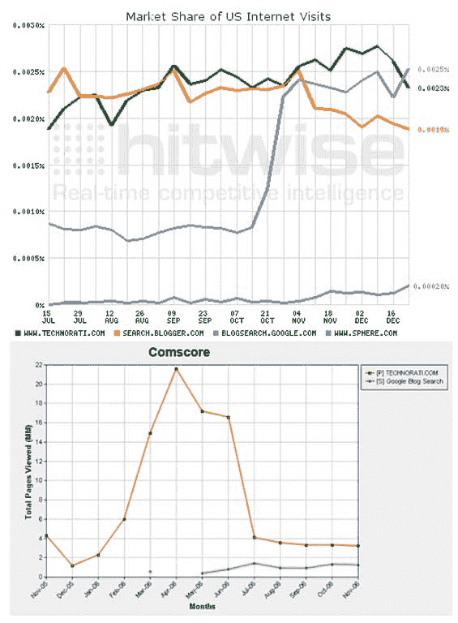

# 谷歌诉 Technorati(和 Hitwise 诉康姆斯克)

> 原文：<https://web.archive.org/web/http://www.techcrunch.com:80/2006/12/28/google-v-technorati-and-hitwise-v-comscore/>

# 谷歌诉 Technorati(和 Hitwise 诉康姆斯克)

度量公司 Hitwise 写了一篇耸人听闻的博文，展示了[谷歌博客搜索](https://web.archive.org/web/20220818234741/http://blogsearch.google.com/)相对于竞争对手 [Technorati](https://web.archive.org/web/20220818234741/http://www.technorati.com/) 和 [Sphere](https://web.archive.org/web/20220818234741/http://www.sphere.com/) 的戏剧性崛起。他们的数据显示，本周，谷歌博客搜索的总访问量首次超过了 Technorati。

根据 Hitwise 的数据，谷歌博客搜索刚刚超过互联网总流量的 0.0025%，而 Technorati 仅为 0.0023%。激增的原因似乎很简单:谷歌在 10 月份将他们的博客搜索产品链接到谷歌新闻，这对流量产生了直接而显著的影响。谷歌还在谷歌主页的“更多”部分增加了博客搜索链接。仅仅领先是不够的，但是最近 Technorati 的流量下降使得博客搜索排名第一。

谷歌对博客搜索的额外关注会导致流量激增，这是有道理的，但我们向康姆斯克求证。真是个惊喜。

康姆斯克讲述了一个完全不同的故事，这个故事在给定事实的情况下没有什么意义。最新的康姆斯克数据(11 月)显示，Technorati 有 300 万页面浏览量，而谷歌博客搜索只有 100 万。但是康姆斯克在过去的 12 个月里也显示了非常不稳定的 Technorati 数据，从 2006 年 4 月的 2200 万页面浏览量到 2005 年 12 月的 100 万页面浏览量。

我们以前见过康姆斯克出现不稳定交通波动的情况。8 月份，康姆斯克显示 Del.icio.us 的流量出现了显著的下降，而 Hitwise 则表示流量正在上升。雅虎披露了一些内部流量统计，结果证明康姆斯克大错特错。在 Technorati 诉谷歌一案中，这看起来又错了。

