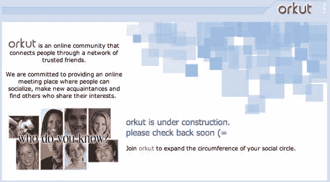

# 谷歌 Orkut 宕机 13 小时以上 TechCrunch

> 原文：<https://web.archive.org/web/http://www.techcrunch.com:80/2006/12/29/googles-orkut-down-for-13-hours/>

# 谷歌 Orkut 宕机超过 13 小时

谷歌的社交网络 Orkut T1 今年在 T2 有所复兴，截至太平洋标准时间凌晨 2 点，已经在 T4 关闭了 13 个小时。鉴于该网站已经离线很长时间，这不太可能是一次升级。这[只是](https://web.archive.org/web/20221208235856/http://www.beta.techcrunch.com/2006/12/28/gmail-disaster-reports-of-mass-email-deletions/)不是谷歌的[日](https://web.archive.org/web/20221208235856/http://www.beta.techcrunch.com/2006/12/28/google-top-searches-based-on-nothing/)。
 ***更新:** Orkut 现在重新上线，经过 [22 小时](https://web.archive.org/web/20221208235856/http://uptime.pingdom.com/site/month_summary/site_name/www.orkut.com/year/2006/month/December)的停机时间。*

