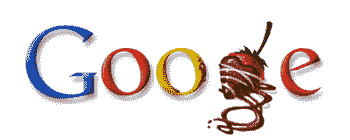

# 谷歌的情人节标志看起来很像“谷歌”——TechCrunch

> 原文：<https://web.archive.org/web/http://www.techcrunch.com:80/2007/02/14/googles-valentines-logo-sure-looks-like-googe/>

# 谷歌的情人节标志看起来确实像“谷歌”

一位[读者](https://web.archive.org/web/20220121110649/http://www.boredworkers.com/)来信建议我们好好看看[谷歌的情人节标志](https://web.archive.org/web/20220121110649/http://www.google.com/)，它似乎去掉了“L”，而只是简单地写着“谷歌”草莓茎可以说是丢失的字母，但这个对我来说读起来像胶粘物。

点击这里查看谷歌过去所有的节日标识[。](https://web.archive.org/web/20220121110649/http://www.google.com/holidaylogos.html)

更新:谷歌在他们的[博客](https://web.archive.org/web/20220121110649/http://googleblog.blogspot.com/2007/02/strawberries-are-red-stems-are-green.html)上讨论了这个问题。丹尼斯·黄说没有遗漏的字母，“我只知道那些灵魂中有真正浪漫和诗意的人会立即看到微妙之处。”一些博客指出,“Googe”是一个诗人的名字，他写过一两次关于爱情的文章。随便啦。谷歌一切都好。