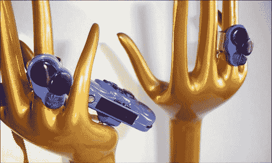

# 专为科技爱好者打造的 GPS 戒指

> 原文：<https://web.archive.org/web/http://techcrunch.com/2007/07/20/gps-enabled-rings-for-tech-saavy-tourists/>

# 为科技爱好者准备的 GPS 戒指

如果你想看起来像你知道你要去哪里，但你不想处理 jocks 取笑你的 GPS 功能的街道步行设备，你很快就可以让一对淑女的紫色戒指作为你的向导。让我们看看运动员如何取笑淑女紫环，哈！

一位名叫盖尔·奈特的英国淑女开发了一个由 GPS 振动环组成的系统，每个手指上戴一个，轻轻推你到正确的方向。如果你应该向右转，你右手上的戒指就会发出嗡嗡声。如果你应该往左走，你左手的铃声就会响。如果你走错了路，它们都会响。

一切都通过一个寻呼机大小的设备来控制，你可以戴在脖子上或放在口袋里。你在设备中输入一个英国邮政编码(类似于邮政编码，但更精确)，然后你就上路了。

这在美国的主要城市可能是一个有用的系统，尽管必须有不同的方法来找到你的目的地，因为我们的邮政编码可以覆盖许多许多平方英里。此外，美国人不喜欢紫色。我们需要纯金、钻石或小海豹皮来做戒指。

[振动环引导城市游客](https://web.archive.org/web/20130628184027/http://news.bbc.co.uk/2/hi/technology/6905286.stm)【BBC 新闻】