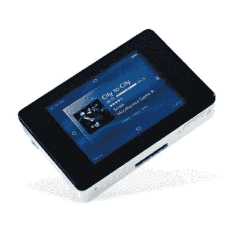
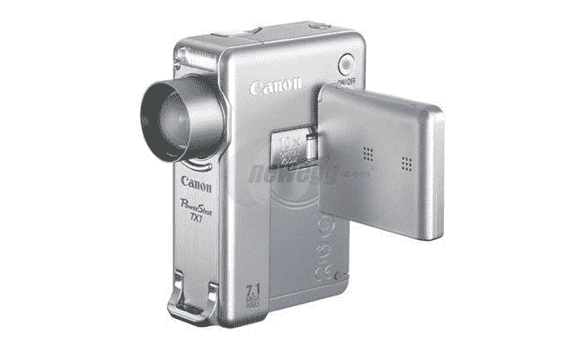
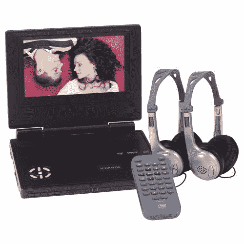

# 户外运动:有视频，会旅行

> 原文：<https://web.archive.org/web/http://techcrunch.com/2007/07/02/great-outdoors-have-video-will-travel/>

你怎么又看视频了？

夏天正在全面展开。外面热得要命，天空很美，水很暖——你需要出去走走。所以，带上你的家人或一些好朋友，去小径、斜坡或海滩。找点事做。只要记得尽可能配备最好的视频设备。因为在 14 个小时的车程到你的目的地和鲍勃掉进一片毒藤之间，你会希望这些记忆永远存在。

重要的事情先来。你要开始一次旅行。我强调“T4 之旅”这个词是因为你会在某种座位上坐很长一段时间。在去目的地的路上，无论你如何旅行，你都会想轻装上阵。过度包装肯定会导致极度不适，视频也没关系。所以在去那里的路上，我建议带上一个 iPod。花 249 美元，你就可以买到一个 30GB 的 iPod，它可以存储音乐、照片和视频，让你娱乐。你也可以从 iTunes 音乐商店购买你最喜欢的电视节目，这样你就可以在整个旅程中欣赏像 *Scrubs* 这样的节目。我们会提到另一个与 I 相关的设备，但我们厌倦了它。

戴尔的 XPS m1330

如果 iPod 的屏幕对您来说太小，并且您想要更多的存储和视频选项，请查看戴尔的 XPS M1330 笔记本电脑。刚刚发布，仅重 4 磅，超小型设计。它仍然有一个光驱的空间，所以你可以在一个非常漂亮的显示器上轻松地观看你的 DVD。另外，你可以随时[盗版一些电影](https://web.archive.org/web/20150922190624/http://crunchgear.com/2007/05/14/help-key-the-essential-guide-to-piracy/)随身携带。

iRiver 的 Clix 2 播放视频和音乐

所以现在你去你的度假胜地。太好了，只是下雨了。在接下来的三个小时里，你将如何在机场度过？我来告诉你怎么做，iRiver 的 Clix 2。这款相对不知名(至少在美国)的视频播放器在网上售价低至 170 美元，但却拥有强大的功能。一个漂亮、清晰的 2.2 英寸屏幕以多种格式显示电影。你也可以加载你的音乐或照片来保持忙碌。凭借 USB 2.0 和更长的电池续航时间，这将让您在任何情况下都能忙碌数小时。

佳能的 TX1 将数码相机和高清摄像机合二为一

好吧，也许没下雨。你已经去了你租的露营地或海滨别墅，派对已经开始了。图片很棒，但你想用视频主动捕捉瞬间，对吧？你得看看佳能 TX1。这是一个 710 万像素的数码相机，操作起来就像摄像机一样。它还可以拍摄高清视频和声音，这对于一台仅售 500 美元的相机来说是惊人的，而且还能拍出很棒的照片。这是我在一段时间内见过的最酷的小玩意之一，任何认真想在旅行中制作 DVD 的人都会想试试 TX1。

我敢肯定，拥有所有这些设备是很棒的，但数码相机和视频播放器需要存储才能工作。既然你有旅行的钱，为什么不在你的记忆卡上全力以赴呢？毕竟，你确实需要过度补偿小学时恶霸拿走你午饭钱的时间。抛开你的过去，看看闪迪的 SD 卡需求。SanDisk Ultra II SD Plus 系列不仅具有快速的读/写速度，还包括一个内置的 USB 端口，因此您可以在危急时刻将其连接到您的计算机上。此外，如果您现有的笔记本电脑没有读卡器，这意味着可以少带一件东西。Ultra II SD Plus 系列的可用容量仅包括 512MB、1GB 和 2GB。

随着你所有的需求得到满足，终于到了放松和享受快乐时光的时候了。永远在 1 和 0 上捕捉你最喜欢的时刻，确保强调你要对你的朋友搞的恶作剧。这是你的假期，所以一定要好好享受。当你都做好了，你会有很多拆包工作要做。另外，您的视频之旅还没有结束！

我不想打击你，但是你的妻子想要一张 DVD 和她的朋友分享。如果你想轻松制作旅行视频和照片的 DVD，可以考虑试试 iMac。这是一台一体化电脑，配有 DVD 刻录机和易于使用的编辑软件。在几乎没有电脑使用经验的情况下，你仍然可以编辑一部电影，并将其刻录到 DVD 上，以便明年观看。

说到明年，当你决定开车而不是坐飞机时，你可以在旅途中观看你制作的特别 DVD。只需 100 美元，你就可以从亚马逊买到 Audiovox D17 便携式 DVD 播放器。它便宜，重量轻，而且能完成任务。它甚至配有两套耳机，这样你和一个朋友就可以一边看《掠夺者》，一边背诵卡尔·韦瑟斯的所有台词。

捕食者在这个显示屏上会看起来很帅

假期和旅行应该是充满乐趣的。所以，当你发现自己在长途飞行或乘车旅行时，请记住，有很多小工具可以帮助你度过难关。花 20 美元买一季[发展受阻](https://web.archive.org/web/20150922190624/http://www.youtube.com/results?search_query=arrested+development&search=)，在你的笔记本电脑或 iPod 上观看。当你看完几集的时候，你已经在去目的地的半路上了，准备好享受这个夏天了。

如果你有兴趣购买我上面提到的任何物品，请查看我找到的这些链接:

*   [苹果 iPod](https://web.archive.org/web/20150922190624/http://www.apple.com/store/)*   [佳能 TX1 相机](https://web.archive.org/web/20150922190624/http://www.newegg.com/Product/Product.asp?Item=N82E16830120197&ATT=30-120-197&CMP=OTC-Froogle)*   [戴尔 XPS M1330 笔记本电脑](https://web.archive.org/web/20150922190624/http://www.dell.com/content/products/productdetails.aspx/xpsnb_m1330?c=us&cs=19&l=en&s=dhs)*   [iRiver Clix 2](https://web.archive.org/web/20150922190624/http://www.amazon.com/iRiver-CXW-2G-Digital-Music-Player/dp/B000FGEC94)*   [Audiovox D17 便携式 DVD 播放器](https://web.archive.org/web/20150922190624/http://www.amazon.com/Audiovox-D1718Pk-Portable-Player-Bonus/dp/B000O9W74E/ref=sr_1_2/002-4149528-4344849?ie=UTF8&s=audio-video&qid=1183055988&sr=1-2)*   [SanDisk Ultra II SD Plus 卡](https://web.archive.org/web/20150922190624/http://www.sandisk.com/Products/Default.aspx?CatID=1119)*   [苹果 iMac](https://web.archive.org/web/20150922190624/http://www.apple.com/imac)