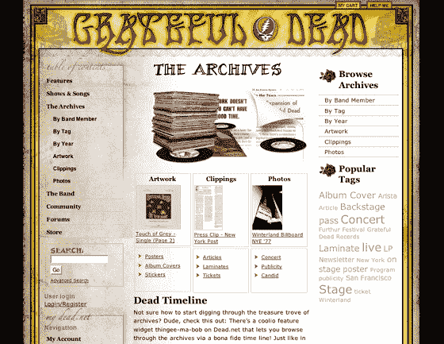
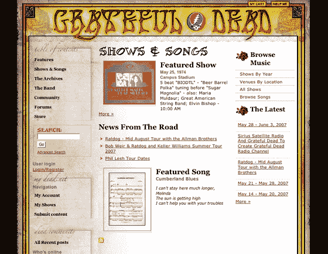

# 感恩死去的粉丝网站重生为社交网络技术危机

> 原文：<https://web.archive.org/web/http://www.techcrunch.com:80/2007/05/29/greatful-dead-fan-site-reborn-as-social-network/>

# 感恩死去的粉丝网站重生为社交网络

在巅峰时期，摇滚传奇《感恩的死者》吸引了大约 40，000 名自称为“死亡之神”的人跟随他们周游全国。这一运动最初是由音乐会上的粉丝聚会和邮件列表上的网络产生的。随着[Dead.net](https://web.archive.org/web/20221006195251/http://dead.net/)的发布，邮件列表变成了数字，它将在未来 24 小时内作为一个成熟的社交网络重新发布。

新版《Dead.net》是在 Drupal 内容管理平台上创建的，其特色是大量的档案，对感恩而死的历史、歌曲、照片、大事记和展览进行编目，并通过标签进行索引和搜索。死亡用户将能够参与论坛，上传他们自己的照片，并为他们参加的音乐会和节目添加书签。粉丝们也可以免费下载独家 mp3 节目。

独家截图如下:
 

