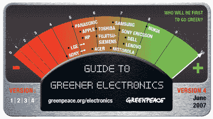

# 绿色和平组织评价电子公司:诺基亚最佳，索尼最差

> 原文：<https://web.archive.org/web/http://techcrunch.com/2007/07/02/greenpeace-rates-electronics-companies-nokia-best-sony-worst/>

绿色和平组织的环保人士上周公布了环境最佳和最差公司名单(特别是在有害化学物质方面)，诺基亚名列榜首。绿色和平组织引用其“从许多产品中消除最有害的化学物质”的政策，给这款总部位于芬兰的手机打了 8 分(满分 10 分)。绿色和平组织将索尼评为最差，声称它在单个生产者责任方面有双重标准。似乎索尼在欧洲支持它，而在美国反对它。

媒体宠儿苹果以 5.3 的评分在 14 个中排名第 10，受到打击，因为它在市场上没有“绿色”产品。不要脸，苹果。不要脸。

[公司如何排队](https://web.archive.org/web/20140308103816/http://www.greenpeace.org/international/campaigns/toxics/electronics/how-the-companies-line-up)【绿色和平】