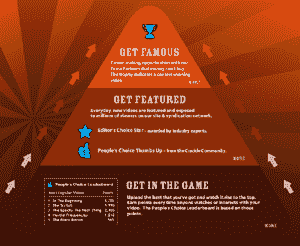

# 石斑鱼走向好莱坞

> 原文：<https://web.archive.org/web/http://www.techcrunch.com:80/2007/07/16/grouper-can-now-make-you-rich-and-famous/>

 [石斑鱼的](https://web.archive.org/web/20160608035215/http://www.crunchbase.com/company/crackle)彻底报废自己的旧址，重生为[爆裂声](https://web.archive.org/web/20160608035215/http://www.crackle.com/)。新网站旨在为他们的母公司索尼公司发现顶尖的在线视频人才，为制片人提供名利双收的机会。所有老的石斑鱼账号都会转到 Crackle。

新酒店将是一个目的视频网站，由 12 个品牌频道组成，涵盖不同的节目理念，如喜剧、音乐新闻和动画。该网站包括一个频道指南和高质量的 16 x 9 嵌入式视频播放器。广告商将能够在网站上的视频和横幅广告之间放置 5 到 15 秒的广告。

**电光火石的品牌频道**

 Crackle 会种子频道 1000 个自己专业制作的视频。他们将按照频道的节目理念(喜剧、音乐等)添加顶级用户生成的内容。)由社区和他们的编辑团队选出。

作为回报，Crackle 将在不同程度上奖励制片人，从收入分成到七位数的制作交易。所有获奖者将获得索尼硬件和电影产品网络的分销权。索尼的分销网络和 60 人的广告团队真正推动了这种开放式工作室模式，超越了目前其他视频初创公司所能提供的任何东西。

该网站将推出 12 个用户支持的频道中的 4 个。审判日是一个频道，主持人将“评判”公众中的其他人，然后发现他们的判断是否正确。Scrambler 是独立摇滚的视频音乐杂志。《走钢丝》是单口喜剧的虚拟舞台。湿漆是一个动画通道。他们还有一个专门介绍美国消防队的频道，其内容将与索尼的“拯救我”系列搭配。最后，移动目标是一个小品综艺频道即将推出。

**奖励生产者**

 电光火石会让用户爬上如右图所示的“名声金字塔”。任何人都可以向频道提交视频，这些视频将被放入通用视频库中。观众将投票选出最佳视频，在特殊交易的比赛期间，用户选择的两个顶级视频将加入编辑的挑选，被选中进行制作交易。

制作人可能获得的回报因渠道而异。所有被选中的内容将通过他们的嵌入式视频播放器网络分发，还有索尼 PSP、Bravia 和索尼 Vaio。Crackle 声称每月有 2500 万独立访客。

他们的短片和移动目标频道的季度获胜者将获得与哥伦比亚电影公司关于制作更多视频的交易的推介会议。喜剧频道的获胜者将有机会在洛杉矶、纽约或芝加哥的即兴喜剧俱乐部登台表演，并向即兴喜剧实验室推销他们的短裤。动画获奖者将获得现金奖励，有机会向工作室推销他们的短片，以及 Siggraph 2008 的门票。

他们的第一个例子是布莱恩·道尔顿制作的喜剧节目《神先生》, Grouper 以更大的发行量的承诺从 YouTube 上吸引了该节目。自 3 月以来，该节目的 10 集已经获得了超过 570 万次观看。索尼公司已经挑选了另外 10 集的节目，在他们的移动目标频道上首播。

**如何叠加**

自从 Grouper 拒绝了 1000 万美元的第二轮融资并于去年 8 月被卖给索尼后，Crackle 与最初宣布的计划有了很大的不同。我们报道称，索尼将使用 Grouper 的技术在线分享质量较低的索尼视频，通过 P2P 分发 DVD 质量的视频，并允许用户创建精选索尼媒体资产的混搭。这两个想法与 Veoh 和 Eyespot 已经在做的非常相似。

YouTube 仍然可以为你的视频带来更多的流量([这个](https://web.archive.org/web/20160608035215/http://youtube.com/watch?v=LnpN-cxeVf8)一天就超过 100 万)，让你出名。然而，Crackle 拥有其他视频网络所没有的索尼，这意味着他们可以为顶级制片人提供更丰厚的预算以及好莱坞式的名气。

这是一个可以被其他网站复制的模式。iFilm 及其母公司维亚康姆(Viacom)可以类似地与顶级制片人达成协议，并在他们的地产上发行。其他社交视频网站，如 Veoh，他们的 P2P 播放器 Joost 和 Babelgum，虽然缺乏索尼的影响力，但也可以进入这个圈子。所有这些网站对顶级内容的竞争加剧，这对蓬勃发展的互联网视频行业来说是好消息，但对现有的视频内容网络来说可能是坏消息，因为它们无法与索尼提供的内容相媲美。