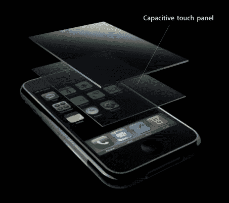

# 猜猜今天谁捡到了一部 iPhone？！

> 原文：<https://web.archive.org/web/http://techcrunch.com/2007/06/12/guess-who-picked-up-an-iphone-today/>

不，这不是克朗彻奇齿轮，但沃尔特·莫斯伯格做到了，他不怕炫耀。在所有地方中，他决定在《纪事报》的总统论坛上展示这款神奇的手机。是啊，我也不知道那是什么。莫斯伯格称，手机是目前值得关注的三种技术之一，而 iPhone 处于这场革命的前沿，或者类似的东西。那么他对 iPhone 有什么看法呢？

> “我不知道我是否会给它一个好的评价，”他说，并指出在写评论之前，他将在接下来的几周内使用手机。“我已经能看出一些我不喜欢的东西。我看到了其他一些我非常喜欢的东西。”

很公平，莫斯伯格。不知道他目前为止不喜欢什么？会不会是缺少键盘？嗯。

> “他们声称，通过智能软件，他们已经找到了一种方法，实际上比你想象的更加准确和有效，我正在测试这个命题，”他说。“我可以告诉你，在第一个小时，它比我想象的要好一点，但我仍然不确定它是否像普通键盘一样好——第一个小时不是一个非常公平的测试，所以我将继续努力。”

[沃尔特·莫斯伯格向学院领导展示他的新 iPhone](https://web.archive.org/web/20160307082421/http://chronicle.com/wiredcampus/article/2144/walt-mossberg-shows-college-leaders-his-new-iphone) 【有线校园】