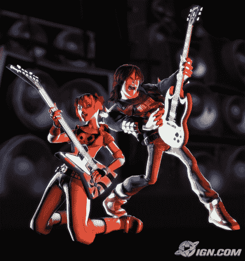

# 吉他英雄 2 曲目列表| TechCrunch

> 原文：<https://web.archive.org/web/http://techcrunch.com/2006/10/10/guitar-hero-2-track-list/>

《吉他英雄 2》,将于 11 月 7 日登陆 Playstation 2，2007 年春季登陆 Xbox 360，最终发布了令人惊叹的曲目列表。这份名单比以前更大、更重，而且将会影响到更广泛的游戏玩家。我记得在玩《吉他英雄》的无数个小时里，我都在想，“我们什么时候才能随着一些严肃的杂色音乐摇滚起来？”我的祈祷终于得到了回应。这是:

**1。开场舔舐**杂色调味酱——向魔鬼大喊
但泽——母亲
廉价诡计——投降
狼母——女人
脊椎穿刺——今晚我今晚要摇滚你

**2。暖暖的**
吻——昂首阔步者
涅槃——心形盒子
警察——瓶中信息
范·海伦——你真的得到我了
堪萨斯州——继续任性的儿子

**3。扣弦者**喷火战机乐队——活扳手
戴着镣铐的爱丽丝——尸骨
伊基·波普和活宝们——搜寻并消灭伪装者——纹身情圣
黑色安息日——战争猪

**4。痛打并焚烧**
搜查令——樱桃派
屁眼冲浪者——昨晚谁在我房间里
马修·斯威特——女友
滚石乐队——你没听见我敲门吗
枪炮与玫瑰——我的宝贝

**5。碎片归来**
愤怒反抗机器——以
普里默斯的名义杀人——渔夫约翰
宝剑——芙蕾雅
瘦李奇——恶名
铁匠——最后一个孩子

**6。无情的即兴重复**
心——为你疯狂
石神庙飞行员——被纸心上的洞绊倒
流浪猫——摇滚小镇
奥尔曼兄弟——杰西卡
简的瘾——停

**7。愤怒的艺术品**
炭疽——疯人院
生命的尽头——带我回家
上帝的羔羊——安息
霍顿·希特牧师——精神病患者弗雷库特
拉什——YYZ

**8。熔脸者**
复仇七倍——野兽与妓女
自杀倾向——制度化
迪克·戴尔——米西卢
梅加迪思——18 号机库
林纳德·斯金纳德乐队——自由之鸟

好吧，所以*吉他英雄 2* 缺少了铁娘子和 AC/DC，但也许他们会作为奖励曲目加入游戏。还有一个传言是，我每次死亡都会出现在游戏中。我的头发为这场比赛准备好了，你的呢？
[吉他英雄 2 曲目列表](https://web.archive.org/web/20230221224132/http://xbox360.ign.com/articles/737/737956p1.html)【ign】