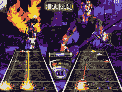

# 吉他英雄来到 Wii

> 原文：<https://web.archive.org/web/http://techcrunch.com/2007/02/08/guitar-hero-coming-to-wii/>

# 吉他英雄来到 Wii

那些喜欢假装癫痫发作和玩人造吉他的人应该很兴奋地知道，你有史以来最喜欢的游戏，动视的吉他英雄，即将在任天堂 Wii 上推出。Tanooki 的伙计们向 Activision 首席执行官 Mike Griffith 证实了《吉他英雄》将会出现在任天堂的噱头游戏机上。这个人自己说:

> 我们的战略与前一个周期的关键区别是，除了对索尼和微软平台的全面支持，我们将积极地针对任天堂平台，与我们的多平台战略和任天堂的预期增长保持一致。在 2008 财年，我们将把 DS 和 Wii 上的产品增加一倍，包括蜘蛛侠、史莱克、变形金刚和吉他英雄。

等等，这句话是不是意味着任天堂 DS 版的《吉他英雄》也将推出？我想我们只能等着瞧了。

哦，尽管我不是最大的 Wii 粉丝，我确实认为如果《吉他英雄》应该在游戏机上，那应该是 Wii。做真正的沙发跳水加分？摇滚。

[突破:吉他英雄来到 Wii！](https://web.archive.org/web/20210301232102/http://www.thetanooki.com/2007/02/08/breaking-guitar-hero-comes-to-the-wii/)