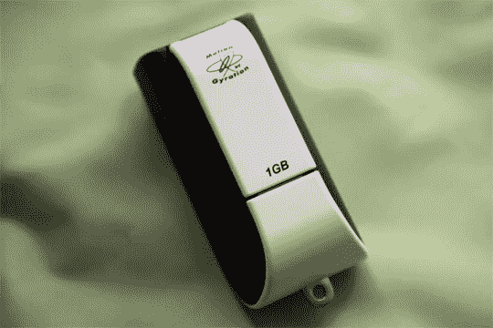

# 回转陀螺运输机实践

> 原文：<https://web.archive.org/web/http://techcrunch.com:80/2006/09/18/gyration-gyrotransport-hands-on/>

上周末我们已经[在 GyroTransport 上做了一个很好的视频](https://web.archive.org/web/20141010090105/http://crunchgear.com/2006/09/16/gyration-gyrotransport-quick-look/)，所以我们就多评论一下，就此打住。我很少使用演示遥控器，因为到目前为止，它们都相当不精确和笨重。幸运的是，199 美元的 GyroTransport 既不是。

它可以无缝地与 MAC 和 PC 配合使用，并包括内置于无线加密狗的 1GB 内存。它本质上是一个即插即用的鼠标，无需驱动程序就能立即出现在你的系统中。有四个按钮:鼠标左键和右键，一个用于移动光标的激活按钮，以及一个用于在屏幕上快速移动的“滑动”按钮。指针本身在后面的重量很轻，所以感觉你实际上拿着的东西比一个中空的塑料块更有实质意义。

它运行在一个 AAA 电池，包括，并对触摸两个按钮。它非常便携，湿重约 3 盎司，无线加密狗连接到指针的背面，保持整洁。它现在可以在网上找到，如果你做任何形式的展示，它绝对是一个有用的工具。

[产品页面](https://web.archive.org/web/20141010090105/http://www.gyration.com/en-us/gyrotransport.html)【回转】