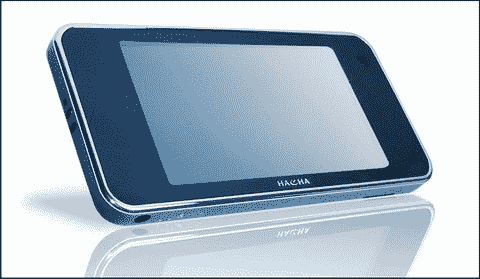
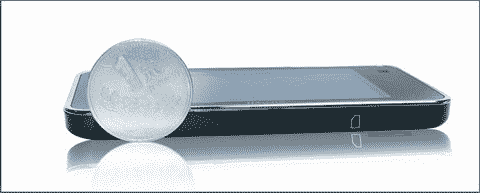

# 哈查 PC20 PMP:7.7 毫米厚…我的意思是薄！TechCrunch

> 原文：<https://web.archive.org/web/http://techcrunch.com/2007/07/31/hacha-pc20-pmp-77mm-thic-thin-i-mean/>

真的，没有什么比在只知道最基本信息的情况下写东西更让我喜欢的了。拿着这个 Hacha PC20 PMP。我可以告诉你，它有一个 3 英寸的屏幕，7.7 毫米相当薄。所以我将把你从所有聪明的俏皮话中拯救出来，只留给你一张照片。

嘭！谢谢你的时间。也许下次我们会有*信息*。

[PC20](https://web.archive.org/web/20160422050705/http://www.imp3.net/articles/1/2007_07/14177_1.html)【iMP3.net via[Ubergizmo](https://web.archive.org/web/20160422050705/http://www.ubergizmo.com/15/archives/2007/07/hacha_pc20_heads_to_fat_house.html)