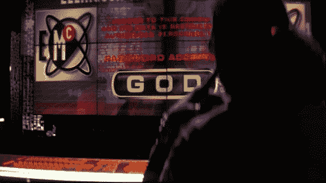

# “黑客”受到蒸汽朋克待遇

> 原文：<https://web.archive.org/web/http://techcrunch.com/2007/07/02/hackers-gets-the-steampunk-treatment/>

你们要砍死吉普森，难道

今天在 BoingBong 上，一个有很多空闲时间和敏锐幽默感的人用蒸汽朋克语言重新制作了黑客的整个脚本。它被称为“时钟”，这里有一个例子会让那些熟悉“黑客”的人发笑:

> 我想我知道谁是邪恶的创造者。
> 
> 凯特
> 什么？谁啊。
> 
> 艾灵顿的安全情妇。我…我给了她一份你给我的计划。
> 
> 凯特
> 呸！墨菲先生！
> 
> 我不知道上面有什么！
> 
> 零食
> 哎呀老兄。这是普遍愚蠢的，男人！
> 
> 尼康
> 哟，你真是个好记者，伙计。

它太好了，不能错过，所以一定要留出五分钟来读一读。点击下面的链接获得完整的脚本。今天我要把“黑客”的 DVD 放在重播上。

[“时钟”脚本](https://web.archive.org/web/20150927152436/http://www.xorph.com/clockers/clockers.html)【xor ph via[boing boing](https://web.archive.org/web/20150927152436/http://www.boingboing.net/2007/07/02/steampunk_screenplay.html)