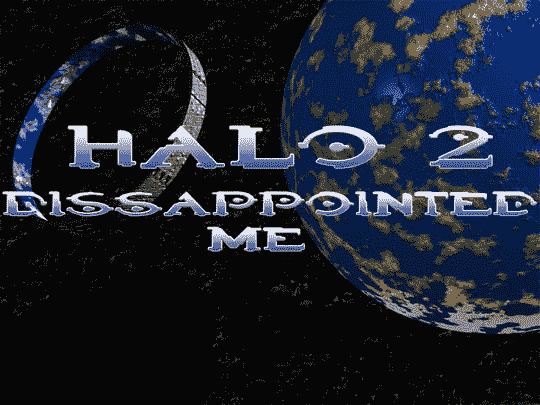

# Vista 延迟版光环

> 原文：<https://web.archive.org/web/http://techcrunch.com/2007/05/24/halo-2-for-vista-delayed/>

考虑到《光晕 3》测试版已经全面上映，似乎现在还有人对《光晕 2》感兴趣。

微软现在出来说，Windows Vista 的 Halo 2 已经从 5 月 18 日推迟到 6 月 8 日。它的价格会很高，有地图编辑器，人们还是会买。考虑到游戏只能在 Windows Vista 上运行，我有没有提到这也是提高 Vista 销量的催化剂？在这一点上，你还不如买一个带有 Xbox 的副本就完事了。

[光环 2 PC 再次被推回](https://web.archive.org/web/20141219141536/http://www.computerandvideogames.com/article.php?id=164710)【CVG】